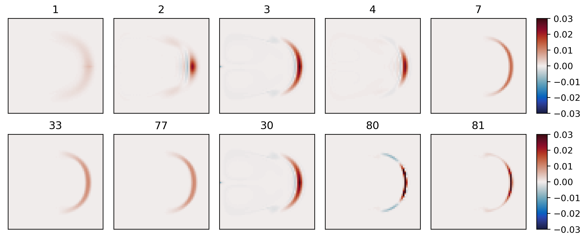
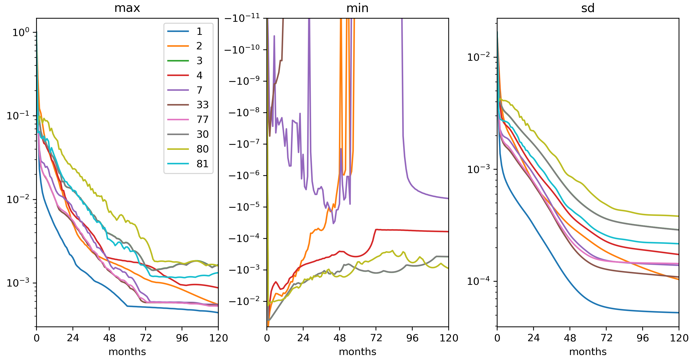

.. _sec_gyre_advection:

Ocean Gyre Advection Schemes
============================

  (in directory: :filelink:`verification/tutorial_advection_in_gyre/`)

This set of examples is based on the barotropic and baroclinic gyre
MITgcm configurations, that are described in
:numref:`sec_eg_baro` and :numref:`tutorial_baroclinic_gyre`.
The examples in this section explain how to introduce a passive tracer
into the flow field of the barotropic and baroclinic gyre setups and
looks at how the time evolution of the passive tracer depends on the
advection or transport scheme that is selected for the tracer.

Passive tracers are useful in many numerical experiments. In some cases
tracers are used to track flow pathways, for example in Dutay et al. (2002)
:cite:`dutay:02` a passive tracer is used to track pathways
of CFC-11 in 13 global ocean models, using a numerical configuration
similar to the example described in
:numref:`sec_eg_offline_cfc`). In other cases tracers are used
as a way to infer bulk mixing coefficients for a turbulent flow field,
for example in Marshall et al. (2006) :cite:`marshall:06` a tracer is used to infer
eddy mixing coefficients in the Antarctic Circumpolar Current region. Typically, in
biogeochemical and ecological simulations large numbers of tracers are
used that carry the concentrations of biological nutrients and
concentrations of biological species. When using
tracers for these and other purposes it is useful to have a feel for the
role that the advection scheme employed plays in determining properties
of the tracer distribution. In particular, in a discrete numerical model,
tracer advection only approximates the continuum behavior in space and
time and different advection schemes introduce different approximations
so that the resulting tracer distributions vary. In the following text
we illustrate how to use the different advection schemes available in
MITgcm, and discuss which properties are well represented by each
scheme. The advection schemes selections also apply to active tracers (e.g.,
:math:`T` and :math:`S`) and the character of the schemes also affects
their distributions and behavior.

Advection and tracer transport
~~~~~~~~~~~~~~~~~~~~~~~~~~~~~~

In general, the tracer problem we want to solve can be written

.. math::
   \frac{\partial C}{\partial t} = -\vec{\bf U} \cdot  \nabla  C + S
   :label: eg-adv-gyre-generic-tracer

where :math:`C` is the tracer concentration in a model cell, :math:`\vec{\bf U}=(u,v,w)`
is the model 3-D flow field. In
:eq:`eg-adv-gyre-generic-tracer`, :math:`S` represents
source, sink and tendency terms not associated with advective transport.
Example of terms in :math:`S` include (i) air-sea fluxes for a dissolved
gas, (ii) biological grazing and growth terms (for a biogeochemical
problem) or (iii) convective mixing and other sub-grid parameterizations
of mixing. In this section we are primarily concerned with

#. how to introduce the tracer term, :math:`C`, into an integration

#. the different discretized forms of the :math:`-\vec{\bf U} \cdot  \nabla  C` term
   that are available

Introducing a tracer into the flow
~~~~~~~~~~~~~~~~~~~~~~~~~~~~~~~~~~

The MITgcm ptracers package (see section :numref:`sub_phys_pkg_ptracers`
for a more complete discussion of the ptracers package and section
:numref:`using_packages` for a
general introduction to MITgcm packages) provides pre-coded support for
a simple passive tracer with an initial distribution at simulation time
:math:`t=0` of :math:`C_0(x,y,z)`. The steps required to use this
capability are

#. **Activating the ptracers package.** This simply requires adding the
   line ``ptracers`` to the file :filelink:`code/packages.conf <verification/tutorial_advection_in_gyre/code/packages.conf>`.

#. **Setting an initial tracer distribution.**

Once the two steps above are complete we can proceed to examine how the
tracer we have created is carried by the flow field and what properties
of the tracer distribution are preserved under different advection
schemes.

Selecting an advection scheme
~~~~~~~~~~~~~~~~~~~~~~~~~~~~~

- flags in :filelink:`input/data <verification/tutorial_advection_in_gyre/input/data>`
  and :filelink:`input/data.ptracers <verification/tutorial_advection_in_gyre/input/data.ptracers>`

- overlap width

- ``#define`` CPP option :varlink:`PTRACERS_ALLOW_DYN_STATE` in
  :filelink:`code/PTRACERS_OPTIONS.h <verification/tutorial_advection_in_gyre/code/PTRACERS_OPTIONS.h>` as required for SOM case

Comparison of different advection schemes
~~~~~~~~~~~~~~~~~~~~~~~~~~~~~~~~~~~~~~~~~

#. Conservation

#. Dispersion

#. Diffusion

#. Positive definite

   Dye evolving in a double gyre with different advection schemes. The
   figure shows the dye concentration one year after injection into a
   single grid cell near the left boundary.

   Maxima, minima and standard deviation (from left) as a function of
   time (in months) for the gyre circulation experiment from
   :numref:`fig_adv_gyre_maps`.

