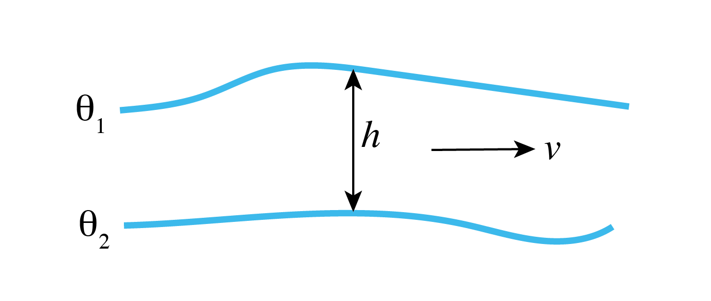

.. _sec_eg_reentrant_channel:

Southern Ocean Reentrant Channel Example
========================================

  (in directory  :filelink:`verification/tutorial_reentrant_channel/`)

This example experiment simulates flow through a reentrant channel,
crudely mimicking the `Antartic Circumpolar Current <https://en.wikipedia.org/wiki/Antarctic_Circumpolar_Current>`_.
The fluid is forced by a zonal wind stress, :math:`\tau_x`, that varies
sinusoidally in the north-south direction and is constant in time,
and by temperature relaxation at the surface and northern boundary.
The grid is Cartesian and the Coriolis parameter :math:`f` is
defined according to a mid-latitude beta-plane equation :math:`f(y) = f_{0}+\beta y` ;
here we choose :math:`f_0 < 0` to place our domain in the Southern Hemisphere.
A linear EOS is used with density only depending on T, and there is no sea ice.

Although important aspects of the of the Southern Ocean and Antarctic Circumpolar Current
were realized in the early 20th Century (e.g., Sverdrup 1933 :cite:`sverdrup:33`),
understanding this system has been a major research focus in recent decades. Many significant breakthroughs in understanding its
dynamics, role in the global ocean circulation, and role in the climate system
have been achieved (e.g., Marshall and Radko 2003 :cite:`marshall:03`;
Olbers and Visbeck 2004 :cite:`olbers:04`; Marshall and Speer 2012 :cite:`marshall:12`;
Nikurashin and Vallis 2012 :cite:`nikurashin:12`;
Armour et al. 2016 :cite:`armour:16`;Sallée 2018 :cite:`sallee:18`).
Much of this understanding came about using simple, idealized reentrant channel models
in the spirit of the model described in this tutorial.
The configuration here is fairly close to that employed in Abernathy et al. (2011) :cite:`abernathy:11`
(using the MITgcm) with some important differences,
such as our introduction of a deep north-south ridge.

We assume the reader is familiar with a basic MITgcm
setup, as introduced in tutorial :ref:`Barotropic Ocean Gyre <sec_eg_baro>`
and tutorial :ref:`Baroclinic Ocean Gyre <tutorial_baroclinic_gyre>`.
Although the setup here is again quite idealized, we introduce many new features and capabilities of MITgcm.
Novel aspects include using MITgcm packages
to augment the physical modeling capabilities, discussion of partial cells to represent topography, and an introduction to
the layers diagnostics package (:filelink:`/pkg/layers`). Our initial focus is on running and comparing coarse-resolution
solutions with and without activating the Gent-McWilliams ("GM") (1990)
:cite:`gen-mcw:90` mesoscale eddy parameterization (:filelink:`/pkg/gmredi`).
As first noted in Danabashoglu et al. (1994) :cite:`danabasoglu:94`,
use of GM in coarse resolution models improves global temperature distribution, poleward and surface heat fluxes, and locations
of deep-water formation (see also the Gent 2011 :cite:`gent:11` perspective on two decades GM usage in ocean models).
At the end of this tutorial, we will describe how to increase resolution to an eddy-permitting regime, detailing the few
necessary changes in code and parameters, and examine this high-resolution solution.
In our discussion, our focus will be on highlighting how the representation of mesoscale eddies
plays a significant role in governing the equilibrium state.

Below we describe the idealized configuration in detail (see :numref:`channel_simulation_config`). 
The sinusoidal wind-stress variations are defined thus: 

.. math:: 
   \tau_x(y) = \tau_{0}\sin \left( \frac{y}{2 L_y} \pi \right),

where :math:`L_{y}` is the lateral domain extent and
:math:`\tau_0` is set to :math:`0.2 \text{ N m}^{-2}`. Surface temperature restoring
varies linearly from 10 :sup:`o`\ C at the northern boundary
to -2 :sup:`o`\ C at the southern end. A wall is placed at the southern boundary of our domain,
thus our setup is only reentrant in the east-west direction. Because MITgcm assumes a periodic
domain in both the east-west and north-south directions, our southern wall effectively functions as a wall
at the northern boundary as well.
The full water column in the northern boundary is a "sponge layer"; 
relaxing temperature though the full water column will partially constrain the stratification,
and in the eddy-permitting solution will absorb any eddies reaching the northern boundary (truly acting as a "sponge").
As shown in :numref:`channel_simulation_config`, a north-south ridge runs through the bottom topography,
which is otherwise flat with a depth :math:`H` of 3980 m. A sloping notch cuts through the middle of the ridge;
in the latitude band where the notch exists, potential vorticity :math:`f/H` contours are unblocked,
which permits a vigorous zonal barotropic jet. Shaved cells are used to represent the topography.

  .. figure:: figs/SO_config.png
      :width: 100%
      :align: center
      :alt: reentrant channel configuration
      :name: channel_simulation_config

      Schematic of simulation domain, bottom topography, and wind-stress forcing function for the idealized reentrant channel numerical setup.
      A full-depth solid wall at :math:`y=` 0 is not shown; because MITgcm is also periodic in the north-south direction, this acts as a wall
      on the north boundary.

Similar to both tutorial :ref:`Barotropic Ocean Gyre <sec_eg_baro>` and tutorial :ref:`Baroclinic Ocean Gyre <tutorial_baroclinic_gyre>`,
we use a linear equation of state which is a function of temperature only
(temperature is our only model tracer field). :numref:`channel_simulation_temp_ic` shows initial conditions in temperature at
the northern and southern end of the domain. Initial temperature decreases exponentially from the relaxation SST profile
to -2 :sup:`o`\ C at depth :math:`H`.
Note that this same northern boundary profile is used to restore temperature in the model's sponge layer, as discussed above. 

 .. figure:: figs/temp_ic.png
      :width: 100%
      :align: center
      :alt: reentrant channel initial temp
      :name: channel_simulation_temp_ic

      Initial conditions in temperature at the northern and southern boundaries.
      Note this same northern boundary profile is used as relaxation temperature in the model's sponge layer.

Equations Solved
----------------

The active set of equations solved is identical to those employed in tutorial :ref:`Baroclinic Ocean Gyre <tutorial_baroclinic_gyre>`
(i.e., hydrostatic with an implicit linearized free surface), except
here we use standard Cartesian geometry rather than spherical polar coordinates:

.. math::
   :label: eg-channel-model_equations_uv

   \frac{Du}{Dt} - fv +
     \frac{1}{\rho_c}\frac{\partial p'}{\partial x} +
      \nabla _h \cdot ( -A_{h}  \nabla _h u ) +
     \frac{\partial}{\partial z} \left( -A_{z}\frac{\partial u}{\partial z} \right)
   &= \mathcal{F}_u
     \\
   \frac{Dv}{Dt} + fu +
     \frac{1}{\rho_c}\frac{\partial p'}{\partial y} +
      \nabla _h \cdot ( -A_{h}  \nabla _h v ) +
     \frac{\partial}{\partial z} \left( -A_{z}\frac{\partial v}{\partial z} \right)
   &= \mathcal{F}_v
 
.. math::
      \frac{\partial \eta}{\partial t} +  \nabla _h \cdot \left( H \vec{\widehat{\bf u}} \right) = 0 

.. math::
   \frac{D\theta}{Dt} +  \nabla _h \cdot (-\kappa_{h}  \nabla _h \theta)
   + \frac{\partial}{\partial z} \left( -\kappa_{z}\frac{\partial \theta}{\partial z} \right)
   = \mathcal{F}_\theta
   :label: channel_model_theta

.. math::
   p^{\prime} =    g\rho_{c} \eta + \int^{0}_{z} g \rho^{\prime} dz
   :label: channel_model_press

Forcing term :math:`\mathcal{F}_u` is applied as a source term in
the model surface layer  and zero in the interior, and source term :math:`\mathcal{F}_v`
is zero everywhere. The forcing term :math:`\mathcal{F}_\theta` is applied as temperature relaxation in the surface
layer and throughout the full depth in the two northern-most rows (in the coarse resolution setup) of the model domain.

.. _sec_SOch_num_config:

Discrete Numerical Configuration
--------------------------------

The coarse-resolution domain is discretized with a uniform Cartesian grid spacing in the horizontal set to :math:`\Delta x=\Delta y=50` km,
so that there are 20 grid cells in the :math:`x` direction and 40 in the :math:`y` direction.
There are 49 levels in the vertical, ranging from 5.5 m depth at the surface to 149 m at depth.
An "optimal grid" vertical spacing here was generated using the hyperbolic tangent method of Stewart et al. (2017) :cite:`stewart:17`,
implemented in Python at https://github.com/kialstewart/vertical_grid_for_ocean_models,
based on input parameters of ocean depth (4000 m), minimum (surface) depth (5 m),
and maximum depth (150 m). In ocean modeling, it is generally advantageous to
have finer resolution in the upper ocean (as was also done
previously in tutorial :ref:`Baroclinic Ocean Gyre <tutorial_baroclinic_gyre>`),
but note that the transition to deeper layers should be done gradually, in the interests
of solution fidelity and stability. Although our topography is idealized, the topography is
not *a priori* discretized to levels matching the vertical grid, and we make
use of MITgcm's ability to represent "partial cells" (see :numref:`sec_topo_partial_cells`).

Otherwise, the numerical configuration is similar to that of tutorial :ref:`Baroclinic Ocean Gyre <tutorial_baroclinic_gyre>`),
with an important difference: we use a high-order
advection scheme ("7th order one-step method w/limiter", :varlink:`tempAdvScheme` parameter code 7) for potential temperature
instead of :ref:`center second-ordered differences <adv_cent_2ord>`
(which is used in tutorials :ref:`Barotropic Ocean Gyre <sec_eg_baro>`
and :ref:`Baroclinic Ocean Gyre <tutorial_baroclinic_gyre>` and is the model default).
This will enable us to use the same numerical scheme in both coarse-resolution and eddy-permitting simulations.
Note that this advection scheme does NOT use :ref:`Adams-Bashforth <adams-bashforth>` time stepping for potential temperature, instead
using its own time stepping scheme.
The fixed flux form of the momentum equations are solved, as described in :numref:`flux-form_momentum_equations`,
with an implicit linear free surface (:numref:`press_meth_linear`). Laplacian diffusion of tracers and momentum is employed.
The pressure forces that drive
the fluid motions, :math:`\partial_x p^\prime`
and :math:`\partial_y p^\prime`, are found by
summing pressure due to surface elevation :math:`\eta` and the
hydrostatic pressure, as discussed in :numref:`baroc_eq_solved`.
The sea-surface height is found by solving implicitly the 2-D (elliptic) surface pressure equation
(see :numref:`press_meth_linear`).

Additional changes in the numerical configuration for the eddy-permitting simulation are discussed in :numref:`reentrant_channel_soln_eddy`.

.. _sec_tutSOch_num_stab:

Numerical Stability Criteria
~~~~~~~~~~~~~~~~~~~~~~~~~~~~

The numerical considerations behind our setup are not trivial.
We do not wish the thermocline to be diffused away by numerics.
Accordingly, we employ a vertical diffusivity acting on temperature typical of background values
observed in the ocean, :math:`1 \times 10^{-5}` m\ :sup:`2` s\ :sup:`--1`). 
We now examine numerical stability criteria to help choose and assess parameters for our coarse resolution study:
parameters used in the eddy-permitting setup are discussed in :numref:`reentrant_channel_soln_eddy`.

We anticipate development of a large barotropic flow through the notch in the topographic ridge which will have
implications for the length of the timestep we will be able to use. Let us consider the advective
CFL condition :eq:`eq_SOch_cfl_stability` and the stability of inertial oscillations :eq:`eq_SOCh_inertial_stability`:

.. math::
    S_{\rm adv} = 2 \left( \frac{ |c_{\rm max}| \Delta t}{ \Delta x} \right) < 0.5 \text{ for stability}
    :label: eq_SOch_cfl_stability

.. math::
    S_{\rm inert} = f {\Delta t} < 0.5 \text{ for stability}
    :label: eq_SOCh_inertial_stability

where :math:`|c_{\rm max}|` is the maximum horizontal velocity. We anticipate :math:`|c_{\rm max}|` of order ~ 1 ms\ :sup:`-1`.
Note that barotropic currents of this speed over a jet of order ~ 100 km in lateral scale will result in a
barotropic flow of the order of hundreds of Sverdups. At a resolution of 50 km, :eq:`eq_SOch_cfl_stability` then
implies that the timestep must be less than 12000 s and  :eq:`eq_SOCh_inertial_stability` implies a timestep less than 3500 s.
Here we make a conservative choice of :math:`\Delta t = 1000` s to keep  :math:`f {\Delta t}` under 0.20.

How shall we set the horizontal viscosity? From the numerical stability criteria:

.. math::
    S_{\ Lh} = 4 A_{h} \Delta t \left( \frac{1}{{\Delta x}^2} + \frac{1}{{\Delta y}^2} \right)  < 1.0 \text{ for stability}
    :label: eq_SOch__laplacian_stability

Note that the threshold in :eq:`eq_SOch__laplacian_stability` is < 1.0 instead of < 0.6 due to our
specification (in :filelink:`input/data <verification/tutorial_reentrant_channel/input/data>`)
that momentum dissipation NOT be solved using Adams-Bashforth, as
discussed :ref:`below <momDissip_not_in_AB>`.
With :math:`\Delta t = 1000` s, we can choose :math:`A_{h}` to be as large as order
:math:`1 \times 10^{5}` m\ :sup:`2` s\ :sup:`--1`. However, such a value would result in a
very viscous solution. We anticipate a boundary current along the deep ridge and sloping notch on a scale given by Munk scaling:

.. math::
    M = \frac{2\pi}{\sqrt{3}} \left( \frac { A_{h} }{ \beta } \right)^{\frac{1}{3}}.
    :label: eq_SOch__munk_layer

We can set :math:`A_{h}` to as low as 100 m\ :sup:`2` s\ :sup:`--1` and still comfortably resolve the
Munk boundary layer on our grid. However, guided by an ensemble of runs exploring parameter space,
we found the solution with :math:`A_{h} = 100 ` m\ :sup:`2` s\ :sup:`--1`, while stable, was rather noisy.
As a compromise, a value of :math:`A_{h} = 2000` m\ :sup:`2` s\ :sup:`--1` reduced solution noise
whilst also controlling the strength of the barotropic current. This is the value used here. 
Also note with this choice :math:`A_{h} / \Delta x` gives a velocity
scaling of 4 cm/s,  a reasonable value.

Regarding the vertical viscosity, we choose to solve this term implicitly (Euler backward
time-stepping) by setting :varlink:`implicitViscosity` to ``.TRUE.`` in
:filelink:`input/data <verification/tutorial_reentrant_channel/input/data>`, which results in no
additional stability constraint on the model timestep (see :numref:`implicit-backward-stepping`).
Otherwise, given that our vertical resolution is quite fine near the surface (approximately 5 m),
the following stability criteria would have applied:

.. math::
   S_{\rm Lv} = 4 \frac{A_{v} \Delta t}{{\Delta z}^2} < 1.0 \text{ for stability}
   :label: eq_SOch__laplacian_v_stability

which effectively would limit our choice for :math:`A_{v}` to very small values.
For simplicity, and given that away from the equator coarse resolution models are typically not 
very sensitive to the value of vertical viscosity, we pick a constant value of :math:`A_{v} = 3\times10^{-3}` m\ :sup:`2` s\ :sup:`--1`
over the full domain, somewhere in between (in geometric mean sense) typical values
found in the mixed layer (:math:`\sim 10^{-2}`) and in the deep ocean (:math:`\sim 10^{-4}`) (Roach et al. 2015 :cite:`roach:15`)
Note this implicit scheme is also used for vertical diffusion of tracers, for which
it can also be used to represent convective adjustment (again, because it is unconditionally stable regardless of diffusivity value).

.. _sec_eg_reentrant_channel_config:

Configuration
-------------

The model configuration for this experiment resides under the directory :filelink:`verification/tutorial_reentrant_channel/`.

The experiment files

 - :filelink:`verification/tutorial_reentrant_channel/code/SIZE.h`
 - :filelink:`verification/tutorial_reentrant_channel/code/LAYERS_SIZE.h`
 - :filelink:`verification/tutorial_reentrant_channel/code/DIAGNOSTICS_SIZE.h`
 - :filelink:`verification/tutorial_reentrant_channel/input/data`
 - :filelink:`verification/tutorial_reentrant_channel/input/data.pkg`
 - :filelink:`verification/tutorial_reentrant_channel/input/data.gmredi`
 - :filelink:`verification/tutorial_reentrant_channel/input/data.rbcs`
 - :filelink:`verification/tutorial_reentrant_channel/input/data.layers`
 - :filelink:`verification/tutorial_reentrant_channel/input/data.diagnostics`
 - :filelink:`verification/tutorial_reentrant_channel/input/eedata`
 - verification/tutorial_reentrant_channel/input/bathy.50km.bin
 - verification/tutorial_reentrant_channel/input/zonal_wind.50km.bin
 - verification/tutorial_reentrant_channel/input/T_surf.50km.bin
 - verification/tutorial_reentrant_channel/input/temperature.50km.bin
 - verification/tutorial_reentrant_channel/input/T_relax_mask.50km.bin

contain the code customizations and parameter settings for this 
experiment. Below we describe these customizations in detail.
 
Compile-time Configuration
~~~~~~~~~~~~~~~~~~~~~~~~~~

File :filelink:`code/packages.conf <verification/tutorial_reentrant_channel/code/packages.conf>`
^^^^^^^^^^^^^^^^^^^^^^^^^^^^^^^^^^^^^^^^^^^^^^^^^^^^^^^^^^^^^^^^^^^^^^^^^^^^^^^^^^^^^^^^^^^^^^^^

.. literalinclude:: ../../../verification/tutorial_reentrant_channel/code/packages.conf
    :linenos:
    :caption: verification/tutorial_reentrant_channel/code/packages.conf

In addition to the pre-defined standard package group ``gfd``, we define four additional packages. 

- Package :filelink:`pkg/gmredi` (see :ref:`sub_phys_pkg_gmredi`):
  This implements the Gent and McWilliams parameterization (as first described in Gent and McWilliams 1990 :cite:`gen-mcw:90`)
  of geostrophic eddies. This mixes along sloping neutral surfaces (here, just :math:`T` surfaces).
  It is used instead of large prescribed diffusivities aligned in the horizontal plane (parameter :varlink:`diffKh`).
  In :numref:`reentrant_channel_solution` we will illustrate the marked improvement
  in the solution resulting from the use of this parameterization.

- Package :filelink:`pkg/rbcs` (see :ref:`sub_phys_pkg_rbcs`):
  The default MITgcm code library permits relaxation boundary conditions only at the ocean surface;
  in the setup here, we relax temperature over the full-depth :math:`xz` plane
  along our domain's northern border. By including the :filelink:`pkg/rbcs` code library in our model build,
  we can relax selected fields (tracers or
  horizontal velocities) in any 3-D location.

We also include two packages which augment MITgcm's diagnostic capabilities.

- Package :filelink:`pkg/layers`:
  This calculates the thickness and transport of layers of specified density (or temperature, or salinity;
  here, temperature and density are aligned because of our simple equation of state).
  Further explanation of :filelink:`pkg/layers` parameter options and output is given :ref:`below <tut_SO_layers>`.

- Package :filelink:`pkg/diagnostics`:
  This selects which fields to output, and at what frequencies. This was introduced in
  tutorial :ref:`Baroclinic Ocean Gyre <tutorial_baroclinic_gyre>`.

File :filelink:`code/SIZE.h <verification/tutorial_reentrant_channel/code/SIZE.h>`
^^^^^^^^^^^^^^^^^^^^^^^^^^^^^^^^^^^^^^^^^^^^^^^^^^^^^^^^^^^^^^^^^^^^^^^^^^^^^^^^^^

.. literalinclude:: ../../../verification/tutorial_reentrant_channel/code/SIZE.h
    :linenos:
    :caption: verification/tutorial_reentrant_channel/code/SIZE.h

Our model tile size is defined above to be 20 :math:`\times` 10 gridpoints, so four tiles (i.e., :varlink:`nSy` =4)
are required to span the full domain in :math:`y`.
Note that our overlap sizes (:varlink:`OLx`, :varlink:`OLy`) are set to 4 in this tutorial,
as required by our choice of advection scheme (see discussion in :numref:`sec_tutSOch_num_stab`
and :numref:`adv_scheme_summary` from which this required overlap can be obtained);
in tutorial :ref:`Baroclinic Ocean Gyre <tutorial_baroclinic_gyre>` this was set to 2,
which is the mimimum required for the default :ref:`center second-ordered differences <adv_cent_2ord>` scheme.
For this setup we will specify a reasonably high resolution
in the vertical, using 49 levels.

File :filelink:`code/LAYERS_SIZE.h <verification/tutorial_reentrant_channel/code/LAYERS_SIZE.h>`
^^^^^^^^^^^^^^^^^^^^^^^^^^^^^^^^^^^^^^^^^^^^^^^^^^^^^^^^^^^^^^^^^^^^^^^^^^^^^^^^^^^^^^^^^^^^^^^^

.. literalinclude:: ../../../verification/tutorial_reentrant_channel/code/LAYERS_SIZE.h
    :linenos:
    :caption: verification/tutorial_reentrant_channel/code/LAYERS_SIZE.h

As noted above in this file's comments, we must set the discrete number of layers to use in our diagnostic calculations.
The model default is 20 layers. Here we set ``PARAMETER(`` :varlink:`Nlayers` ``= 37 )`` and so choose 37 layers.
In making this choice, one needs to ensure sufficiently fine layer bounds in the density (or temperature) range of interest,
while also possible to specify fairly coarse bounds in other density ranges.
The specific temperatures defining layer bounds will be prescribed in :filelink:`input/data.layers <verification/tutorial_reentrant_channel/input/data.layers>`

File :filelink:`code/DIAGNOSTICS_SIZE.h <verification/tutorial_reentrant_channel/code/DIAGNOSTICS_SIZE.h>`
^^^^^^^^^^^^^^^^^^^^^^^^^^^^^^^^^^^^^^^^^^^^^^^^^^^^^^^^^^^^^^^^^^^^^^^^^^^^^^^^^^^^^^^^^^^^^^^^^^^^^^^^^^

.. literalinclude:: ../../../verification/tutorial_reentrant_channel/code/DIAGNOSTICS_SIZE.h
    :linenos:
    :caption: verification/tutorial_reentrant_channel/code/DIAGNOSTICS_SIZE.h

Here the parameter :varlink:`numDiags` has been changed to allow a combination of up to 35 3-D diagnostic fields or 1715 (=35*49) 2-D fields.

Run-time Configuration
~~~~~~~~~~~~~~~~~~~~~~

.. _reentrant_channel_data:

File :filelink:`input/data <verification/tutorial_reentrant_channel/input/data>`
^^^^^^^^^^^^^^^^^^^^^^^^^^^^^^^^^^^^^^^^^^^^^^^^^^^^^^^^^^^^^^^^^^^^^^^^^^^^^^^^

.. literalinclude:: ../../../verification/tutorial_reentrant_channel/input/data
    :linenos:
    :caption: verification/tutorial_reentrant_channel/input/data

This file, reproduced in its entirety above, specifies the main parameters for the experiment. Parameters for this configuration
(shown with line numbers to left) are as follows.

PARM01 - Continuous equation parameters
####################################### 

- These lines set the horizontal and vertical Laplacian viscosities.
  As in earlier tutorials, we use a spatially uniform value for viscosity in both the horizontal and vertical. We set viscosity to be solved implicitly,
  using the :ref:`backward method <implicit-backward-stepping>`, as discussed in :numref:`sec_tutSOch_num_stab`.

  .. literalinclude:: ../../../verification/tutorial_reentrant_channel/input/data
       :start-at: viscAh
       :end-at: implicitVisc
       :lineno-match:

- These lines set the horizontal and vertical diffusivities. In the standard (coarse resolution) configuration the
  Gent-McWilliams parameterization (:filelink:`pkg/gmredi`) is activated, and we set the horizontal diffusivity to zero
  (which is the default value).
  Similar to tutorial :ref:`Baroclinic Ocean Gyre <tutorial_baroclinic_gyre>`, we set a large vertical diffusivity (:varlink:`ivdc_kappa`)
  for mixing unstable water columns, which requires implicit numerical treatment of vertical diffusion. 
  
  .. literalinclude:: ../../../verification/tutorial_reentrant_channel/input/data
       :start-at: diffKhT
       :end-at: implicitDiff
       :lineno-match:

- The first two lines below set the model's Coriolis parameters (:varlink:`f0` and :varlink:`beta`) to values representative
  of the latitude band encompassing the Antarctic Circumpolar Current. In the last line we set the model
  to use the Jamart and Ozer (1986) :cite:`jamart:86` wet-points averaging method, in lieu of the model
  default (see :numref:`fluxform_cor_terms`; parameter options here are given in :numref:`parms_mom`).
  The method affects the discretization of the Coriolis terms in the momentum equations.
  In this setup -- as we will show, the jet is dominated by barotropic potential vorticity
  conservation -- it turns out the solution is rather sensitive to this discretization (particularly
  adjacent to topography). We tested both the default and wet-points methods, and found the wet-points
  method closer to the eddy-permitting solution, where obviously the discretization of the Coriolis term is better resolved.
  
  .. literalinclude:: ../../../verification/tutorial_reentrant_channel/input/data
       :start-at: f0
       :end-at: selectCoriScheme
       :lineno-match:

- These lines set parameters related to the density and equation of state. Here we choose the same value for the
  Boussinesq reference density :varlink:`rhoConst` as our value :varlink:`rhoNil`, for the linear equation of state.
  To keep things simple, as well as speed up model run-time, we limit ourselves to a single tracer, temperature,
  and tell the model not to step salinity forward in time or include salinity in the equation of state.
  Also note we use a uniform reference temperature (:varlink:`tRef`) throughout the water column. 
  We will be specifying a file for initial conditions of temperature in our simulation, and so :varlink:`tRef` will
  not be used for this purpose (as it was in tutorial :ref:`Baroclinic Ocean Gyre <tutorial_baroclinic_gyre>`).
  Thus, :varlink:`tRef` is only employed here as a reference to compute density anomalies. In principle, one could
  define :varlink:`tRef` to a more representative array of values at each level, but for most applications any
  gain in numerical accuracy is small, and a single representative value suffices.

  .. literalinclude:: ../../../verification/tutorial_reentrant_channel/input/data
       :start-at: rhoConst
       :end-at: saltStep
       :lineno-match:

.. _tut_SO_partialcellparms:

- These lines activate the use of partial cells, as described in :numref:`sec_topo_partial_cells`. :varlink:`hFacMin`\ =0.1 permits
  partial cells that are as small as 10% of the full cell depth, but with :varlink:`hFacMinDr`\ =5.0 m this partial cell must also be
  at least 5 m in depth. Note that the model default of :varlink:`hFacMin`\ =1.0 disables partial cells, i.e., values from a specified bathymetry file are rounded
  up or down to match grid depth interface levels (model variable :varlink:`rF`). See also :numref:`parms_topo` for general information on using these parameters and
  :ref:`below <reentrant_channel_bathy_file>` for additional information about partial cells in this setup.

  .. literalinclude:: ../../../verification/tutorial_reentrant_channel/input/data
       :start-at: hFacMinDr
       :end-at: hFacMin=
       :lineno-match:

- These lines activate the implicit free surface formulation (:numref:`press_meth_linear`) with the exact conservation option enabled, similar
  to tutorial :ref:`Baroclinic Ocean Gyre <tutorial_baroclinic_gyre>`.

  .. literalinclude:: ../../../verification/tutorial_reentrant_channel/input/data
       :start-at: rigidLid
       :end-at: exactConserv
       :lineno-match:

- This instructs the model to use a 7th order monotonicity-preserving advection scheme (code 7) -- basically, a higher-order,
  more accurate, less noisy advection scheme -- instead of the center-differences, 2nd order model default scheme (code 2).
  The downside here is additional computations, costly if running with many tracers, and a larger necessary overlap
  size in :filelink:`SIZE.h <verification/tutorial_reentrant_channel/code/SIZE.h>`, which may get costly if one parallelizes
  the model into many small tiles. We will use the same scheme for both coarse and eddy-permitting resolutions;
  using the higher-order scheme is particularly helpful in the high resolution setup. When using non-Adams-Bashforth
  advection schemes (see :numref:`adv_scheme_summary`), the flag :varlink:`staggerTimeStep` should be set to ``.TRUE.``.

  .. literalinclude:: ../../../verification/tutorial_reentrant_channel/input/data
       :start-at: tempAdv
       :end-at: staggerTime
       :lineno-match:

PARM02 - Elliptic solver parameters
################################### 

These parameters are unchanged from tutorials :ref:`Barotropic Ocean Gyre <sec_eg_baro>`
and :ref:`Baroclinic Ocean Gyre <tutorial_baroclinic_gyre>`.

PARM03 - Time stepping parameters
#################################

- For testing purposes the tutorial is set to integrate 10 time steps,
  but uncomment the line futher down in the file setting :varlink:`nTimeSteps`
  to integrate the solution for 30 years.

  .. literalinclude:: ../../../verification/tutorial_reentrant_channel/input/data
       :start-at: nIter0
       :end-at: nTimeSteps
       :lineno-match:

  .. literalinclude:: ../../../verification/tutorial_reentrant_channel/input/data
       :start-at: nTimeSteps=933
       :end-at:  nTimeSteps=933
       :lineno-match:

- Remaining time stepping parameters are as described in earlier tutorials. See :numref:`sec_tutSOch_num_stab`
  for a discussion on our choice of :varlink:`deltaT`.

  .. literalinclude:: ../../../verification/tutorial_reentrant_channel/input/data
       :start-at: deltaT
       :end-at: monitorSelect
       :lineno-match:

- As in tutorial :ref:`Baroclinic Ocean Gyre <tutorial_baroclinic_gyre>` we set the timescale, in seconds,
  for relaxing potential temperature in the model's top layer (note: relaxation timescale for the northern boundary sidewalls
  is set in :filelink:`data.rbcs <verification/tutorial_reentrant_channel/input/data.rbcs>`, not here).
  Our choice of 864,000 seconds is equal to 10 days.

  .. literalinclude:: ../../../verification/tutorial_reentrant_channel/input/data
       :start-at: tauTheta
       :end-at: tauTheta
       :lineno-match:

.. _momDissip_not_in_AB:

- This instructs the model to NOT apply Adams-Bashforth scheme to the viscosity tendency and other dissipation terms
  (such as side grad and bottom drag) in the momentum equations (the default is to use Adams-Bashforth for all terms);
  instead, dissipation is computed using a explicit, forward, first-order scheme.
  For our coarse resolution setup with uniform harmonic viscosity, this setting is not strictly necessary 
  (and does not noticeably change results). However, for our eddy-permitting run we will use a difference 
  scheme for setting viscosity, and for stability requires this setting.

  .. literalinclude:: ../../../verification/tutorial_reentrant_channel/input/data
       :start-at: momDissip
       :end-at: momDissip
       :lineno-match:

PARM04 - Gridding parameters
############################ 

- We specify a Cartesian coordinate system with 20 gridpoints in :math:`x` and 40 gridpoints in :math:`y`,
  with (default) origin (0,0).

  .. literalinclude:: ../../../verification/tutorial_reentrant_channel/input/data
       :start-at: usingCartesianGrid
       :end-at: delY
       :lineno-match:

- We set the vertical grid spacing for 49 vertical levels, ranging from thickness of approximately 5.5 m at the 
  surface to 149 m at depth. When varying cell thickness in this manner, one must be careful that vertical grid
  spacing varies smoothly with depth; see :numref:`sec_SOch_num_config` for details on how this specific grid spacing was generated.

  .. literalinclude:: ../../../verification/tutorial_reentrant_channel/input/data
       :start-at: delR
       :end-at: 149.35
       :lineno-match:
 
PARM05 - Input datasets
#######################

- The following lines set file names for the bathymetry, zonal wind forcing, and climatological surface temperature relaxation files
  (these files are all 2-D fields, see :ref:`below <reentrant_channel_bathy_file>`)

  .. literalinclude:: ../../../verification/tutorial_reentrant_channel/input/data
       :start-at: bathyFile
       :end-at: thetaClim
       :lineno-match:
 
- This last line specifies the name of the 3-D file containing initial conditions for temperature (as noted above, 
  :varlink:`tRef` values specified in namelist ``PARM01`` are NOT used for the initial state).

  .. literalinclude:: ../../../verification/tutorial_reentrant_channel/input/data
       :start-at: hydrogTheta
       :end-at: hydrogTheta
       :lineno-match:

File :filelink:`input/data.pkg <verification/tutorial_reentrant_channel/input/data.pkg>`
^^^^^^^^^^^^^^^^^^^^^^^^^^^^^^^^^^^^^^^^^^^^^^^^^^^^^^^^^^^^^^^^^^^^^^^^^^^^^^^^^^^^^^^^

.. literalinclude:: ../../../verification/tutorial_reentrant_channel/input/data.pkg
    :linenos:
    :caption: verification/tutorial_reentrant_channel/input/data.pkg

- These first two lines affect the model physics packages we've included in our build, :filelink:`pkg/gmredi`
  and :filelink:`pkg/rbcs`. In our standard configuration, we will activate both (but in an second run, we will opt to NOT
  activate :filelink:`pkg/gmredi`).

  .. literalinclude:: ../../../verification/tutorial_reentrant_channel/input/data.pkg
       :start-at: useGMRedi
       :end-at: useRBCS
       :lineno-match:

- These lines instruct the model to activate both diagnostics packages we've included in our build, :filelink:`pkg/layers`
  and :filelink:`pkg/diagnostics`.

  .. literalinclude:: ../../../verification/tutorial_reentrant_channel/input/data.pkg
       :start-at: useLay
       :end-at: useDiag
       :lineno-match:

File :filelink:`input/data.gmredi <verification/tutorial_reentrant_channel/input/data.gmredi>`
^^^^^^^^^^^^^^^^^^^^^^^^^^^^^^^^^^^^^^^^^^^^^^^^^^^^^^^^^^^^^^^^^^^^^^^^^^^^^^^^^^^^^^^^^^^^^^^^^

.. literalinclude:: ../../../verification/tutorial_reentrant_channel/input/data.gmredi
    :linenos:
    :caption: verification/tutorial_reentrant_channel/input.GM/data.gmredi

Note that this file is ignored with :filelink:`pkg/gmredi` disabled (in :filelink:`input/data.pkg <verification/tutorial_reentrant_channel/input/data.pkg>`,
``useGMRedi=.FALSE.``), but must be present when enabled. Parameter choices are as follows.

- Parameter :varlink:`background_K` sets the Gent-McWilliams "thickness diffusivity", which determines the strength of the parameterized
  geostrophic eddies in flattening sloping isopycnal surfaces. By default, this parameter is also used as diffusivity for the Redi component
  of the parameterization, which diffuses tracers along isoneutral surfaces. It is possible to set the Redi diffusivity to a separate value
  from the thickness diffusivity by setting parameter :varlink:`GM_isopycK` in the above list.
  However, in this setup with a single tracer determining density, it would not serve any purpose because diffusion
  of temperature along surfaces of constant temperature has no impact.

.. literalinclude:: ../../../verification/tutorial_reentrant_channel/input/data.gmredi
    :start-at: 1000.,
    :end-at: 1000.,
    :lineno-match:

- By default, :filelink:`pkg/gmredi` does not select a tapering scheme (see :numref:`sub_gmredi_tapering_stability`); however, for best results, one should be selected.
  Here we choose the tapering approach described in Danabasoglu and McWilliams (1995) :cite:`danabasoglu:95`. Additional choices for the
  tapering scheme (or alternatively, the more simple slope clipping approach), and why such a scheme is necessary, are described in the
  :ref:`GMRedi package documentation <sub_phys_pkg_gmredi>`.

.. literalinclude:: ../../../verification/tutorial_reentrant_channel/input/data.gmredi
    :start-at: dm95
    :end-at: dm95
    :lineno-match:

- We select the advective or "bolus" form of the parameterization,
  which specifies that GM fluxes are parameterized into a :ref:`bolus advective transport <GM_bolus_desc>`, rather
  than implemented as a :ref:`"skewflux" transport <sub_gmredi_skewflux>` via added terms
  in the diffusion tensor (see Griffies 1998 :cite:`gr:98`). The skewflux form is the package default.
  Analytically, these forms are identical, but in practice are discretized differently.
  For instance, the bolus form will, by default, advect tracers with combined eulerian and bolus transport
  (i.e, residual transport) which then inherits the higher order precision of the selected advection scheme 7.
  This can lead to noticeably different solutions in some setups (anecdotally,
  particularly where you have steeply sloping isopycnals near boundaries). For diagnostic
  purposes, the bolus form permits a straightforward calculation of the actual advective transport (from the GM part),
  whereas obtaining this transport using the skewflux form is less straightforward due to discretization issues.

.. literalinclude:: ../../../verification/tutorial_reentrant_channel/input/data.gmredi
    :start-at: TRUE
    :end-at: TRUE
    :lineno-match:

.. _tut_so_channel_rbcs:

File :filelink:`input/data.rbcs <verification/tutorial_reentrant_channel/input/data.rbcs>`
^^^^^^^^^^^^^^^^^^^^^^^^^^^^^^^^^^^^^^^^^^^^^^^^^^^^^^^^^^^^^^^^^^^^^^^^^^^^^^^^^^^^^^^^^^

.. literalinclude:: ../../../verification/tutorial_reentrant_channel/input/data.rbcs
    :linenos:
    :caption: verification/tutorial_reentrant_channel/input/data.rbcs

Setting parameter :varlink:`useRBCtemp` to ``.TRUE.`` instructs :filelink:`pkg/rbcs` that we will be restoring temperature
(and by default, it will not restore salinity, nor velocity, nor any other passive tracers). :varlink:`tauRelaxT` sets the relaxation timescale for
3-D temperature restoring to 864,000 s or 10 days.
The remaining two parameters
are a filename for a 3-D mask of gridpoint locations to restore (:varlink:`relaxMaskFile`),
and a filename for a 3-D field of restoring temperature values (:varlink:`relaxTFile`). See :ref:`below <reentrant_channel_ rbcsfiles>` for further description
of these fields.

File :filelink:`input/data.layers <verification/tutorial_reentrant_channel/input/data.layers>`
^^^^^^^^^^^^^^^^^^^^^^^^^^^^^^^^^^^^^^^^^^^^^^^^^^^^^^^^^^^^^^^^^^^^^^^^^^^^^^^^^^^^^^^^^^^^^^

.. literalinclude:: ../../../verification/tutorial_reentrant_channel/input/data.layers
    :linenos:
    :caption: verification/tutorial_reentrant_channel/input/data.layers

:varlink:`pkg/layers` consists of online calculations which separate water masses into

specified layers, either by temperature, salinity, or density.
Note that parameters here include an array index of 1; it is possible to diagnose layers in both temperature and salinity simultaneously,
for example, in which case one would add a second set of parameters with array index 2. Even though :varlink:`layers_maxNum` is set to 1
(i.e, only allows a for single layers coordinate) in :filelink:`LAYERS_SIZE.h <verification/tutorial_reentrant_channel/code/LAYERS_SIZE.h>`,
the index is still required.

- The parameter :varlink:`layers_name` is set to ``'TH'`` which specifies temperature as our layers coordinate.

.. literalinclude:: ../../../verification/tutorial_reentrant_channel/input/data.layers
    :start-at: layers_name
    :end-at: layers_name
    :lineno-match:

- Parameter :varlink:`layers_bounds` specifies the discretization of the layers coordinate system;
  we span from the lowest possible model temperature (i.e., the coldest restoring temperature at the
  surface or northern boundary, -2 :sup:`o`\ C) to the warmest model temperature (i.e., the warmest
  restoring temperature, 10 :sup:`o`\ C). The number of values here must be :varlink:`Nlayers` +1, as specified
  in :filelink:`LAYERS_SIZE.h <verification/tutorial_reentrant_channel/code/LAYERS_SIZE.h>`.
  Here, :varlink:`Nlayers` is set to 37, so we have 38 discrete :varlink:`layers_bounds`).
  :filelink:`pkg/layers` will not complain if the discretization does not span the full range of
  existing water in the model ocean; it will simply ignore water masses (and their transport) that
  fall outside the specified range in :varlink:`layers_bounds`
  (this will make it impossible however to close the layer volume budget).
  Also note that the range must be monotonically *increasing*, even if this results in a layers
  coordinate k=1:\ :varlink:`Nlayers` that proceeds in the opposite sense as the depth coordinate
  (i.e., the k=1 layers coordinate is at the ocean bottom, whereas the k=1 depth coordinate refers to the ocean surface layer).

.. literalinclude:: ../../../verification/tutorial_reentrant_channel/input/data.layers
    :start-at: layers_bound
    :end-at: 10.0,
    :lineno-match:

File :filelink:`input/data.diagnostics <verification/tutorial_reentrant_channel/input/data.diagnostics>`
^^^^^^^^^^^^^^^^^^^^^^^^^^^^^^^^^^^^^^^^^^^^^^^^^^^^^^^^^^^^^^^^^^^^^^^^^^^^^^^^^^^^^^^^^^^^^^^^^^^^^^^^

.. literalinclude:: ../../../verification/tutorial_reentrant_channel/input/data.diagnostics
    :linenos:
    :caption: verification/tutorial_reentrant_channel/input/data.diagnostics

DIAGNOSTICS_LIST - Diagnostic Package Choices
#############################################

See tutorial :ref:`Baroclinic Ocean Gyre <baroc_diags_list>` for a detailed explanation of parameter settings
to customize :filelink:`data.diagnostics <verification/tutorial_reentrant_channel/input/data.diagnostics>` to a desired set of output diagnostics.

We have divided the output diagnostics into several separate lists
(recall, 2-D output fields cannot be mixed with 3-D fields!!!) The first
two lists are quite similar to what used in tutorial :ref:`Baroclinic Ocean Gyre <baroc_diags_list>`: specifically,
several key 2-D diagnostics are in one file (surface restoring heat flux, mixed layer depth, and free surface height),
and several 3-D diagnostics and state variables in another (theta, velocity components, convective adjustment index).

In diagnostics list 3, we specify horizontal advective heat fluxes
(``ADVx_TH`` and ``ADVy_TH`` in :math:`x` and :math:`y` directions, respectively), vertical advective heat flux (``ADVr_TH``),
horizontal diffusive heat fluxes (``DFxE_TH`` and ``DFyE_TH``), and vertical diffusive heat flux (``DFrI_TH`` and ``DFrE_TH``). Note the latter is
broken into separate implicit and explicit  components, respectively, the latter of which will only be non-zero if :filelink:`pkg/gmredi` activated.
Although we will not examine these 3-D diagnostics below when :ref:`describing the model solution <reentrant_channel_solution>`,
the zonal terms are needed to compute zonally-averaged meridional heat transport, and all terms needed for a
diagnostic attempt at reconciling a heat budget of the model solution.

.. literalinclude:: ../../../verification/tutorial_reentrant_channel/input/data.diagnostics
    :start-at: fields(1:7,3
    :end-at: filename(3
    :lineno-match:

.. _tut_SO_layers:

In diagnostics list 4, we specify several :varlink:`pkg/layers` diagnostics. In our setup we use a linear equation of state based solely on temperature,
so we will diagnose layers of temperature in the model solution, as shown in :numref:`layers_trans_schematic`.

      Schematic of :filelink:`pkg/layers` diagnostics.

.. literalinclude:: ../../../verification/tutorial_reentrant_channel/input/data.diagnostics
    :start-at: fields(1:3,4
    :end-at: fileName(4
    :lineno-match:

Diagnostic ``LaVH1TH`` is the integrated meridional mass transport in the layer;
here we request an annual mean time average (via the ``frequency`` parameter setting),
which will effectively output the quantity :math:`\overline{vh}` (m\ :sup:`2` s\ :sup:`-1`).
``LaHs1TH`` is the layer thickness :math:`h` (m) calculated at "v" points (see :numref:`spatial_discrete_horizontal_grid`).
``LaVa1TH`` is the layer average meridional velocity :math:`v` (m/s).
These diagnostics are all 3-D fields, albeit the vertical dimension here is the layer discretization
in temperature space, which was defined in :filelink:`data.layers <verification/tutorial_reentrant_channel/input/data.layers>`.
See :numref:`reentrant_channel_solution` for examples using these diagnostics to
calculate the residual circulation and the meridional overturning circulation in density coordinates.

DIAG_STATIS_PARMS - Diagnostic Per Level Statistics
###################################################

Here we specify statistical diagnostics of potential temperature and surface relaxation heat flux, output every ten days,
to assess how well the model has equilibrated. See tutorial :ref:`Baroclinic Ocean Gyre <baroc_diags_list>` for a more complete description of syntax
and output produced by these diagnostics.

File :filelink:`input/eedata <verification/tutorial_reentrant_channel/input/eedata>`
^^^^^^^^^^^^^^^^^^^^^^^^^^^^^^^^^^^^^^^^^^^^^^^^^^^^^^^^^^^^^^^^^^^^^^^^^^^^^^^^^^^^

This file uses standard default values (single-threaded) and does not contain
customizations for this experiment.

.. _reentrant_channel_bathy_file:

File ``input/bathy.50km.bin``
^^^^^^^^^^^^^^^^^^^^^^^^^^^^^

This is a 2-D(:math:`x,y`) map of bottom bathymetry,
as generated by the `MATLAB <https://www.mathworks.com/>`_ program :filelink:`verification/tutorial_reentrant_channel/input/gendata.50km.m`
or the `Python <https://www.python.org/>`_ script :filelink:`verification/tutorial_reentrant_channel/input/gendata.50km.py`.
Input files are 32-bit single precision, by default. Our bathymetry file has active ocean grid cells
along both the eastern and western boundaries (i.e., no land points or walls are present along either boundary),
and thus our model will be fully zonally reentrant.
While our northern boundary also consists entirely of active ocean points, we prescribe a wall
along the southern end of our model domain, therefore the model is NOT meridionally reentrant.

Unlike in previous examples, where the bathymetry was discretized
to match depths of defined vertical grid faces (:varlink:`rF`, see :numref:`vgrid-accur-center`),
we have a more complicated bottom bathymetry as defined using a sine function for our bottom ridge.
The model default in such case is to round the bathymetry up or down to the nearest allowed vertical
cell face level. However, the model permits the use of ":ref:`partial cells <sec_topo_partial_cells>`"
(sometimes also referred to as "shaved" or "lopped" cells), which can provide dramatic improvements
in model solution (see Adcroft et al. 1997 :cite:`adcroft:97`). Here, we activate partial cells though
parameter choices :varlink:`hFacMin` and :varlink:`hFacMinDr` in :filelink:`input/data <verification/tutorial_reentrant_channel/input/data>`,
as discussed :ref:`above <tut_SO_partialcellparms>`. The fraction of a vertical cell that
contains fluid is represented in the 3-D output variable :varlink:`hFacC`, which will have a value of 0.0 beneath the ocean floor (and at land points),
1.0 at an active full-depth ocean cell, and a number between :varlink:`hFacMin` and 1.0 for a partial ocean cell. As such, :varlink:`hFacC`
is often quite useful as a "mask" when computing diagnostics using model output.

As an example, consider horizontal location (10,15) in out setup here, located in our bottom ridge along the sloping notch.
In our bathymetry file, the vertical level is specified as -2382.3 m.
This falls between vertical faces located at -2360.1 and -2504.0 [these are grid variable :varlink:`rF`\ (39:40)].
Thus, this grid cell will be included in the active ocean domain as a thin, yet legal, partial cell: :varlink:`hFacC`\ (10,15,39)=0.154.

.. _reentrant_channel_windx:

File ``input/zonal_wind.50km.bin``, ``input/SST_relax.50km.bin``
^^^^^^^^^^^^^^^^^^^^^^^^^^^^^^^^^^^^^^^^^^^^^^^^^^^^^^^^^^^^^^^^

These files are 2-D(:math:`x,y`)
maps of zonal wind stress :math:`\tau_{x}` (Nm\ :sup:`--2`) and surface relaxation temperature (:sup:`o`\ C),
as generated by program :filelink:`verification/tutorial_reentrant_channel/input/gendata.50km.m` or
:filelink:`verification/tutorial_reentrant_channel/input/gendata.50km.py`.
Note that a 2-D(:math:`x,y`) file is expected even though  as specified, both :math:`\tau_{x}` and SST field are only :math:`f(y)`.

.. _reentrant_channel_ rbcsfiles:

File ``input/temperature.50km.bin``
^^^^^^^^^^^^^^^^^^^^^^^^^^^^^^^^^^^

This file specifies a 3-D(:math:`x,y,z`) map of temperature (:sup:`o`\ C),
as generated by :filelink:`verification/tutorial_reentrant_channel/input/gendata.50km.m` or
:filelink:`verification/tutorial_reentrant_channel/input/gendata.50km.py`
(see :numref:`channel_simulation_temp_ic`).
Note again a 3-D(:math:`x,y,z`) file is expected despite temperature begin only :math:`f(y,z)`.
This file is used here for two purposes: first, as specified in
:filelink:`input/data <verification/tutorial_reentrant_channel/input/data>`, these values are used for temperature initial conditions;
secondly, this file was also specified in :filelink:`input/data.rbcs <verification/tutorial_reentrant_channel/input/data.rbcs>`
as a 3-D field used for temperature relaxation purposes.

.. _reentrant_channel_ rbcsmaskfile:

File ``input/T_relax_mask.50km.bin``
^^^^^^^^^^^^^^^^^^^^^^^^^^^^^^^^^^^^

This file specifies a 3-D(:math:`x,y,z`) mask, as required by :filelink:`/pkg/rbcs` to inform the model which gridpoints to relax.
These values should be between 0.0 and 1.0, with 0.0 for no restoring, 1.0 for full restoring, with fractional values as a multiplicative factor
to effectively weaken restoring at that location (see :numref:`sub_phys_pkg_rbcs`). Here, we select a value of 1.0 along the model northern wall
for all sub-surface depths (relaxation at the surface is specified using ``input/SST_relax.50km.bin``,
otherwise you would be restoring the surface layer twice),
and use a fractional value for the :math:`xz` plane of grid cells just south of the northern border (see
:filelink:`verification/tutorial_reentrant_channel/input/gendata.50km.m` or
:filelink:`verification/tutorial_reentrant_channel/input/gendata.50km.py`).

.. _reentrant_channel_build_run:

Building and running the model
------------------------------

This model can be built and run using the standard procedure described in :numref:`building_code` and :numref:`run_the_model`.
(see also :filelink:`README <verification/tutorial_reentrant_channel/README.md>`).

For testing purposes the model is set to run 10 time steps. For a reasonable solution, we suggest
running for 30 years, which requires changing :varlink:`nTimeSteps` to 933120. When making this edit, also
change :varlink:`monitorFreq` to something more reasonable, say 10 days (``=864000.``). Using a single processor core,
it should take 12 hours or so to run 30 years; to speed this up using
`MPI <https://en.wikipedia.org/wiki/Message_Passing_Interface>`_, re-compile using :varlink:`nPy`\ ``=4,`` and :varlink:`nSy`\ ``=1,`` in
:filelink:`SIZE.h <verification/tutorial_reentrant_channel/code/SIZE.h>` and recompile with the ``-mpi`` flag
(see :numref:`running_mpi` for instructions how to run using `MPI <https://en.wikipedia.org/wiki/Message_Passing_Interface>`_,
here you will be using 4 cores).
As an exercise, see if you can speed it up further using additional processor cores, e.g.,
by decreasing the tile size in :math:`x` and increasing :varlink:`nPx`. 

As configured, the model runs with :filelink:`pkg/gmredi` activated, i.e., :varlink:`useGMRedi`\ ``=.TRUE.``
in :filelink:`data.pkg <verification/tutorial_reentrant_channel/input/data.pkg>`. In :numref:`reentrant_channel_solution`
we will also examine a model solution using old-fashioned large horizontal diffusion with :filelink:`pkg/gmredi` deactivated.
The same executable can be used for the non-GM run.
Set :varlink:`useGMRedi`\ ``=.FALSE.`` in :filelink:`data.pkg <verification/tutorial_reentrant_channel/input/data.pkg>`,
and also set :varlink:`diffKhT`\ ``=1000.`` in :filelink:`data <verification/tutorial_reentrant_channel/input/data>` namelist ``PARM01``.
Also, comment out the lines for diagnostics list 5 in :filelink:`data.diagnostics <verification/tutorial_reentrant_channel/input/data.diagnostics>`
or you will get (non-fatal) warning messages in ``STDERR``.

In :numref:`reentrant_channel_soln_eddy` we will present results with
the resolution increased by an order of magnitude, eddy-permitting. Additional required changes to the code and parameters
are discussed.

Model Solution
--------------

Our primary focus in this section is physical interpretation of the model solution,
not how to generate plots from MITgcm output, and thus in parallel we strongly recommend carefully
going through our `Python <https://www.python.org/>`_ analysis code, documented in
`Jupyter Notebook <https://jupyter.org/>`_ format, see
:filelink:`verification/tutorial_reentrant_channel/analysis/py_notebook.ipynb`.
This notebook reads in grid data, discusses (and plots) the setup and forcing data
files in additional detail, and generates figures shown in the tutorial. 
`MATLAB <https://www.mathworks.com/>`_ analysis code 
to generate tutorial output figures is available at
:filelink:`verification/tutorial_reentrant_channel/analysis/matlab_plots.m`.

.. _reentrant_channel_solution:

Coarse Resolution Solution
~~~~~~~~~~~~~~~~~~~~~~~~~~

Before examining the circulation and temperature structure of the solution, let's first assess
whether the solution is approaching a quasi-equilibrium state after 30 years of integration.
Typically, one might expect a solution given this setup to equilibrate over a timescale of
a hundred years or more, given the depth of the domain and the prescribed weak vertical diffusivity.
As in tutorial :ref:`Baroclinic Ocean Gyre <tutorial_baroclinic_gyre>`,
we will make use of the 'Diagnostic Per Level Statistics' to assess equilibrium; specifically,
we will look at the change in surface (restoring) heat flux over time, as well as the potential temperature field.
In this tutorial we use standard :ref:`native Fortan (binary) output <pkg_mdsio>` files (using :filelink:`pkg/mdsio`)
rather than `netCDF <http://www.unidata.ucar.edu/software/netcdf>`_  output (as done in tutorial :ref:`Baroclinic Ocean Gyre <tutorial_baroclinic_gyre>`).
Important note: when using :filelink:`pkg/mdsio`, the statistical diagnostics output is written in plain text,
NOT binary format. An advantage is that this permits a simple unix ``cat`` or ``more`` command to display the file to the terminal window
as integration proceeds, i.e., for a quick check that results look reasonable. The disadvantage however
is that some additional parsing is required (when using `MATLAB <https://www.mathworks.com/>`_) 
to generate some plots using these data. Making use of MITgcm shell script :filelink:`utils/scripts/extract_StD`,
in a terminal window (in the run directory) type

::
  
   % ../../../utils/scripts/extract_StD dynStDiag.0000000000.txt STATDIAGS  dat

where ``dynStDiag.0000000000.txt`` is the name of our statistical diagnostics output file, ``STATDIAGS``
is a name we chose for files generated by running the script, with extension ``dat``.
This shell script extracts data into the following (plain text) files: 

 - STATDIAGS_head.dat  - header file containing metadata
 - STATDIAGS_Iter.dat - list of iteration numbers for which statdiags dumped
 - STATDIAGS_THETA.dat - statdiags for field THETA (diagnostic field specified
   in :filelink:`input/data.diagnostics <verification/tutorial_reentrant_channel/input/data.diagnostics>`)
 - STATDIAGS_TRELAX.dat - statdiags for field TRELAX (diagnostic field specified
   in :filelink:`input/data.diagnostics <verification/tutorial_reentrant_channel/input/data.diagnostics>`)

The files ``STATDIAGS_Iter.dat`` and ``STATDIAGS_«DIAGNAME».dat`` are simple column(s) of data that can be loaded or
read in as an array of numbers using any basic analysis tool. Here we will
make use of another MITgcm utility, :filelink:`utils/matlab/Read_StD.m`,
which uses `MATLAB <https://www.mathworks.com/>`_ to make life a bit more simple for reading in all statistical diagnostic data.
In a `MATLAB <https://www.mathworks.com/>`_ session type

::

  >> [nIter,regList,time,stdiagout,listFlds,listK]=read_StD('STATDIAGS','dat','all_flds');

where

  -  nIter     = number of iterations (i.e., time records) dumped
  -  regList   = list of region numbers (=0 here, as we did not define any regions, by default global output only)
  -  time(:,1) = iteration numbers ; time(:,2) = time in simulation (seconds)
  -  listFlds  = list of fields dumped 
  -  listK     = for each field, lists number of k levels dumped
  -  stdiagout = 5 dimensional output array 
     ( kLev, time_rec, region_rec, [ave,std,min,max,vol], fld_rec )
     where kLev=1 is depth-average, kLev=2:50 is for depths :varlink:`rC`\ (1:49)

A function to parse statistical diagnostics MITgcm output is also available in the python package :ref:`MITgcmutils`.
Executing the python command

:: 

   stdiags_bylev,stdiags_2D,iters = readstats('dynStDiag.0000000000.txt')

will load up the level-by-level statistical diagnostics into ``stdiags_bylev`` (e.g., ``stdiags_bylev['THETA'][:,0,0]``
is the time series for top level average temperature),
``stdiags_2D`` given column-integrated or 2-D fields (e.g., ``stdiags_2D['TRELAX'][:,0]`` is the time series for surface heat flux),
and ``iters`` is iteration number for the time series (e.g. ``iters['TRELAX']`` is a series of iteration numbers for the ``THETA`` diagnostic,
the user is left to convert into time units). See the  :ref:`MITgcmutils` documention for more information.

On the left side of :numref:`channel_soln_stdiags` we show time series of global surface heat flux.
In the first decade there is rapid adjustment, with a much slower trend in both mean and standard deviation
in years 10-30. In the mean there remains a significant heat flux into the ocean in the run without GM (solid),
whereas with GM (dashed) the net heat uptake is also positive, but smaller. The panels
on the right show potential temperature at the surface, mid-level (270 m) and at depth. Note in particular the warming trend at depth
in the run without GM. The SST series display a much less obvious trend (as might be expected given rapid restoring of SST).
Examining these results, we see that after 30 years our run
is not at full equilibrium, presumably due to the long timescale for vertical diffusion.
And, we infer that less surface heating is penetrating to depth in the GM solution. This difference
is also obvious in :numref:`channel_zm_temp_ml` where we plot zonal mean temperature: note the deeper thermocline in the left panel
(without GM), in addition to the deeper mixed layer (and warmer surface) in the southern half of the model domain. The differences
in convective adjustment are remarkable, as shown in :numref:`convadj_comparison`; here we plot a plan view of diagnostic
``CONVADJ``, which is the fraction of the time steps a grid cell is convectively unstable, at 92 m depth.
Note that at this depth, convection is limited to grid cells near the southern boundary in the GM run, whereas a significant portion of the domain
is convecting in the non-GM run: as discussed in Gent (2011) :cite:`gent:11`, the Deacon cell advects cold water northward
at the surface, resulting in unstable water columns and excessively deep mixed layers. Clearly, the
temperature structure of the model solution is sensitive to our mesoscale eddy parameterization (we will explore this further).

  .. figure:: figs/STDIAGS_hf_temp.png
      :width: 100%
      :align: center
      :alt: HF and temperature Stat Diags
      :name: channel_soln_stdiags

      Left: time series of area-integrated heat flux into the surface ocean (blue) and its standard deviation (magenta). 
      Right: area-mean temperature at the surface (top, cyan), in the thermocline (middle, green), and at depth (bottom, red).
      In all panels, solid curves show non-GM run, dashed curves include GM.

  .. figure:: figs/zonaltemp.png
      :width: 100%
      :align: center
      :alt: zonal mean temp and ML depth
      :name: channel_zm_temp_ml

      Zonal-mean temperature (shaded) and zonal-mean mixed layer depth (black line) averaged over simulation year 30.
      Left plot is from non-GM run, right using GM.

  .. figure:: figs/cvctadj.png
      :width: 100%
      :align: center
      :alt: convective adjustment index
      :name: convadj_comparison

      Convective adjustment index: 0= never convectively unstable during year 30, 1= always convectively unstable.
      Left plot is from non-GM run, right using GM.

:numref:`channel_bt_psi` shows the barotropic streamfunction without GM (left) and with GM (right).
The pattern is quite similar in both simulations,
characterized by a jet centered in the latitude bands with the deep notch, with some deflection
to the south after the jet squeezes through the notch. There is a balance between
negative relative vorticity, as the jet curves northward through the notch and then southward again,
and increasing :math:`f` to the north (from the beta-plane) such
that barotropic potential vorticity is conserved. North of the notch, we see in :numref:`channel_zm_temp_ml`
the ocean is much more stratified, with dynamics presumably more baroclinic.

  .. figure:: figs/BTpsi.png
      :width: 100%
      :align: center
      :alt: BT streamfunction
      :name: channel_bt_psi

      Barotropic streamfunction averaged over over simulation year 30. Left plot is from non-GM run, right using GM. Contour interval is 20 Sv.

:numref:`channel_MOC_eul` shows the Eulerian meridional overturning circulation for the non-GM run (left) and GM run (right).
Again, they appear quite similar; what we are observing here is known as a "Deacon Cell" (Deacon 1937 :cite:`deacon:37`; Bryan 1991 :cite:`bryan:91`) forced by surface Ekman transport to the north
(see also Döös and Webb 1994 :cite:`doos:94`, Speer et al. 2000 :cite:`speer:00`), with downwelling in the northern half of the basin and upwelling in the south. The magnitude of this cell,
on the order of 1-2 Sverdrups, may not seem very impressive, but it is important to consider our zonal domain spans only about 1/20th of the
60th parallel south; scaled up, the magnitude of this cell is quite large. Some local recirculation occurs in the latitude bands where the ridge slopes
down to the center of the deep notch.
The centers of these recirculations occur in the bottom 2000 m, where stratification is quite weak, so much of water recirculated here falls within a very narrow density class.
The deep ridge effectively creates east-west sidewalls at depth, thus able to support an overturning in thermal wind balance, whereas no sidewalls exist in
the upper portion of the water column. There is little overturning associated with the deep jet flowing through the flat bottom of the notch.

Also worth noting is that we see some evidence of noise (jaggedy contours) in :numref:`channel_MOC_eul`, despite our rather
large choice of :math:`A_{h}`\ =2000 m\ :sup:`2` s\ :sup:`--1` for (uniform) horizontal viscosity and our higher-order advective scheme. These noise
artifacts increase fairly dramatically for smaller choices of :math:`A_{h}`, although we tested the solution remains stable for :math:`A_{h}` decreased by an order of magnitude.

  .. figure:: figs/MOC_EUL.png
      :width: 100%
      :align: center
      :alt: Eulerian MOC
      :name: channel_MOC_eul

      Eulerian meridional overturning circulation (shaded) averaged over simulation year 30. Left plot is from non-GM run, right using GM. Contour interval is 0.5 Sv.

When using :filelink:`pkg/gmredi`, it is often desirable to diagnose an eddy bolus velocity,
or a bolus transport, in order to compute the *residual circulation* (Ferrari 2003 :cite:`ferrari:03`),
the Lagrangian transport in the ocean (i.e., which effects tracer transport; see, for example, Wolfe 2014 :cite:`wolfe:14`).
Unfortunately the bolus velocity is not directly available from MITgcm,
but must be computed from other GM diagnostics, which differ if the :ref:`skew flux <sub_gmredi_skewflux>`
or :ref:`bolus/advective <GM_bolus_desc>` form of GM is selected.
Here we choose the later form in :filelink:`data.gmredi <verification/tutorial_reentrant_channel/input.GM/data.gmredi>` (``GM_AdvForm =.TRUE.``),
for which a bolus streamfunction diagnostic is available, thus the bolus velocity can be readily computed
(see :filelink:`matlab_plots.m <verification/tutorial_reentrant_channel/analysis/matlab_plots.m>`;
obtaining the bolus velocity, for reasons of gridding,
is a bit more straightforward using the advective form). In :numref:`channel_MOC_EULpBOL` we've computed and added the
bolus velocity to the Eulerian velocity. We see that the upper meridional overturning cell has weakened
in magnitude, particularly in the northern half of the domain. The eddy parameterization will attempt to flatten sloping isopycnals
seen in :numref:`channel_zm_temp_ml`, creating a bolus overturning circulation in the opposite
sense to the Deacon Cell. The magnitude of the GM thickness diffusion effectively
controls the strength of the eddy transport; here we observed only partial cancellation of the Deacon Cell
shown in :numref:`channel_MOC_eul`. In global ocean general circulation models, an observation of near-cancellation
in the Southern Ocean Deacon Cell when the GM parameterization was used
was first reported in Danabasoglu et al. (1994) :cite:`danabasoglu:94`.

  .. figure:: figs/MOC_EULpBOL.png
      :width: 50%
      :align: center
      :alt: Residual MOC in depth space
      :name: channel_MOC_EULpBOL

      Meridional overturning circulation (shaded) from GM simulation including bolus advective transport, averaged over simulation year 30. Contour interval is 0.5 Sv.

Now let's use :filelink:`pkg/layers` output to examine the residual meridional overturning circulation, shown in :numref:`channel_bt_MOC_res_T`.
We integrate the time- and zonal-mean transport in
isopycnal layers (see :numref:`layers_trans_schematic`) to obtain a streamfunction in density coordinates. 
See Abernathy et al. (2011) :cite:`abernathy:11` for a more detailed explanation of this calculation;
this approach is the tried-and-true method to diagnose the residual circulation in an eddy-permitting regime,
as required when we run this setup at higher resolution (:numref:`reentrant_channel_soln_eddy`).
Note that :filelink:`pkg/layers` automatically includes bolus transport from :filelink:`pkg/gmredi` in its
calculations, assuming GM is used.
With temperature as the ordinate in :numref:`channel_bt_MOC_res_T`, vertical flows reflect diabatic processes. The green dashed lines represent the maximum and minimum
SST for a given latitude band, thus representing upper layer circulation within this band. On the left side, without GM, we again see a robust Deacon cell,
with a strong diabatic component, presumably due to horizontal diffusion occurring across sloping isopycnals (i.e. the so-called "Veronis effect", see
Veronis (1975) :cite:`veronis:75` as well as other numerous papers prior to the wide-spread adoption of the GM parameterization in ocean models). [As an aside, it is for lack of a better name
that we label this left plot of :numref:`channel_bt_MOC_res_T`, lacking either eddies or GM, as the residual circulation,
as indeed it is identical to the Eulerian circulation in density coordinates].
On the right side, with GM, the Deacon cell is much weaker due to partial cancellation from the bolus circulation, as noted earlier, but also note
that interior contours of streamfunction run roughly horizontal in the plot. We see some evidence of a deep cell in the lowest temperature classes, less obvious in the
Eulerian MOC :numref:`channel_MOC_eul`. One might ask: what happened to the deep recirculating cells seen in :numref:`channel_MOC_EULpBOL`?
Recall that our discretization of temperature layers is fairly
crude, 0.25 K in the coldest temperatures, and presumably much of this recirculation is "lost" as recirculation within a single density class. If this deep circulation were of interest,
one could simply re-run the model with finer resolution at depth (perhaps increasing the number of layers used,
which requires changing :filelink:`LAYERS_SIZE.h <verification/tutorial_reentrant_channel/code/LAYERS_SIZE.h>` and recompiling).

  .. figure:: figs/MOC_RES.png
      :width: 100%
      :align: center
      :alt: Residual MOC in temperature space
      :name: channel_bt_MOC_res_T

      Residual meridional overturning circulation (shaded) as computed in density (i.e., temperature) coordinates, averaged over simulation year 30. Contour interval is 0.5 Sv.
      Green dashed curves show maximum and minimum SST in each latitude band. Left plot is from non-GM run, right using GM. 

Finally, let's convert the residual circulatiom shown in :numref:`channel_bt_MOC_res_T` back into depth coordinates, see :numref:`channel_bt_MOC_res_Ttoz`.
Solid lines now display contours of zonal mean temperature. On the left, consistent with previous analyses, we see a small, upper ocean counter-clockwise
circulation in the southern sector, where deep mixed layers occur (:numref:`channel_zm_temp_ml`), with the dominant feature again
being the (clockwise) Deacon cell. In contrast, using GM, we see a weak residual clockwise cell aligned along temperature surfaces in the thermocline, with a weak
deep counter-clockwise cell aligned with the coldest temperature contour (i.e., the deep cell seen in :numref:`channel_bt_MOC_res_T`).

  .. figure:: figs/MOC_RES_Z.png
      :width: 100%
      :align: center
      :alt: Residual MOC from layers converted to depth space
      :name: channel_bt_MOC_res_Ttoz

      Residual meridional overturning circulation (shaded) as computed in density coordinates and
      converted back into (zonal mean) depth coordinates, averaged over simulation year 30.
      Black lines show zonal mean temperature, contour interval 1 :sup:`o`\C. Left plot is from non-GM run, right using GM.

.. _reentrant_channel_soln_eddy:

Eddy Permitting Solution
~~~~~~~~~~~~~~~~~~~~~~~~

.. raw:: html

    <iframe width="700" height="350" src="https://www.youtube.com/embed/gO3fvRJ3FUE?rel=0&vq=hd720&autoplay=1&loop=1&playlist=gO3fvRJ3FUE"
    frameborder="0" allow="accelerometer; autoplay; encrypted-media; gyroscope; picture-in-picture" allowfullscreen></iframe>

.. only:: latex

   .. image:: figs/eddymovie_still.png

In this section we discuss a model solution with the horizontal grid space reduced from 50 km to 5 km, which is sufficiently resolved to
permit eddies to form (see above, which shows SST, surface relative vorticity, and surface current speed,
left to right, toward the end of the 30-year simulation).
Vertical resolution is unchanged.
While we provide instructions on how to compile and run in this new configuration,
it will require parallelizing (using `MPI <https://en.wikipedia.org/wiki/Message_Passing_Interface>`_)
on at least a hundred processor cores or else a 30-year integration will take on the order of a month or longer
-- in other words, this requires a large cluster or high-performance computing (HPC) facility to run efficiently.

Running with higher resolution requires re-compiling the code after changing the tile size and number of processors, see 
:filelink:`code/SIZE.h_eddy <verification/tutorial_reentrant_channel/code/SIZE.h_eddy>` (as configured here, for 100 processors;
for faster results change the tile size and use 200 or even 400 processors).
Note we will NOT enable :filelink:`pkg/gmredi` in our eddy run, so it can be eliminated from the list in
:filelink:`packages.conf <verification/tutorial_reentrant_channe/code/packages.conf>` [#]_
(make sure to set :varlink:`useGMRedi`\ ``=.FALSE.`` in :filelink:`data.pkg <verification/tutorial_reentrant_channel/input/data.pkg>`).

In conjunction with the change
in :filelink:`code/SIZE.h_eddy <verification/tutorial_reentrant_channel/code/SIZE.h_eddy>`,
uncomment these lines in ``PARM04`` in :filelink:`data <verification/tutorial_reentrant_channel/input/data>`:

::

   delX=200*5.E3,
   delY=400*5.E3,

to specify 5 km resolution in 200 :math:`\times` 400 grid cells in :math:`x` and :math:`y`.
New files for bathymetry, forcing fields, and initial temperature
can be generated using the `MATLAB <https://www.mathworks.com/>`_ program
:filelink:`verification/tutorial_reentrant_channel/input/gendata_5km.m`
or `Python <https://www.python.org/>`_ script :filelink:`verification/tutorial_reentrant_channel/input/gendata.5km.py`
(don't forget to change the filenames in :filelink:`data.rbcs <verification/tutorial_reentrant_channel/input/data.rbcs>`
and ``PARM05`` in :filelink:`data <verification/tutorial_reentrant_channel/input/data>`).

Running at higher resolution requires a smaller time step for stability. Revisiting :numref:`sec_tutSOch_num_stab`, to maintain advective stability
(CFL condition, :eq:`eq_SOch_cfl_stability`) one could simply decrease the time step by the same factor of 10 decrease as :math:`\Delta x` -- stability
of inertial oscillations is no longer a limiting factor, given a smaller :math:`\Delta t` in :eq:`eq_SOCh_inertial_stability` --
but to speed things up we'd like to keep :math:`\Delta t` as large as possible. With a rich eddying solution, however, is it clear that horizontal velocity
will remain order ~1 ms\ :sup:`--1`? As a compromise, we suggest setting parameter :varlink:`DeltaT`\ ``=250.`` (seconds) in
:filelink:`data <verification/tutorial_reentrant_channel/input/data>`, which we found to be stable. For this choice, a 30-year integration
requires setting :varlink:`nTimeSteps`\ ``=3732480``. 

While it would be possible to decrease (spatially uniform) harmonic viscosity to
a more appropriate value for this resolution, or perhaps use bi-harmonic viscosity
(see :numref:`fluxform_lat_dissip`), we will make use of one of the nonlinear viscosity schemes described in :numref:`nonlinear_vis_schemes`, geared
toward large eddy simulations, where viscosity is a function of the resolved motion. Here, we employ
the :ref:`Leith viscosity <leith_viscosity>` (Leith 1968, Leith 1996 :cite:`leith:68` :cite:`leith:96`).
Set the following parameters in ``PARM01`` of :filelink:`data <verification/tutorial_reentrant_channel/input/data>`:

::

   viscC2Leith = 1.,
   useFullLeith=.TRUE.,
   viscAhGridMax = 0.5,

(and comment out the line :varlink:`viscAh` ``=2000.`` ).
:varlink:`viscC2Leith` is a scaling coefficient which we set to 1.0, :varlink:`useFullLeith` ``=.TRUE.`` uses unapproximated gradients in
the Leith formulation (see :numref:`leith_viscosity`). Parameter :varlink:`viscAhGridMax` places a maximum limit on the Leith viscosity so that
the CFL condition is obeyed (see :numref:`CFL_constraint_visc` and :eq:`eq_SOch__laplacian_stability` in discussion of :ref:`sec_tutSOch_num_stab`).
The values of :varlink:`viscAh` that the Leith scheme generates in this solution generally range
from order 1 m\ :sup:`2` s\ :sup:`--1` in regions of weak flow
to over 100 m\ :sup:`2` s\ :sup:`--1` in jets. Note that while it would have been possible to
use the Leith scheme in the 50 km resolution setup, the scheme was
not really designed to be used at such a large :math:`\Delta x`, and the :math:`A_{h}` it generates
about an order of magnitude below the constant :math:`A_{h} = 2000` m\ :sup:`2` s\ :sup:`--1` employed
in the coarse model runs, resulting in a very noisy solution.

Finally, we suggest adding the parameter :varlink:`useSingleCpuIO` ``=.TRUE.`` in ``PARM01``
of :filelink:`data <verification/tutorial_reentrant_channel/input/data>`.
This will produce global output files generated by the master `MPI <https://en.wikipedia.org/wiki/Message_Passing_Interface>`_ processor,
rather than a copious amount of single-tile files (each processor dumping output for its specific sub-domain).

To compare the eddying solution with the coarse-resolution simulations, we need to take a fairly long
time average; even in annual means there is noticeably variability in
the solution. :numref:`channel_zm_temp_MOC_eddy` through :numref:`channel_MOC_eddy_layers` plot similar
figures as :numref:`channel_zm_temp_ml`-:numref:`channel_bt_MOC_res_Ttoz`,
showing a time mean over the last five years of the simulation.

  .. figure:: figs/MOC_EUL_ztemp_eddy.png
      :width: 100%
      :align: center
      :alt: zonal mean temp and ML depth eddying, EUL MOC
      :name: channel_zm_temp_MOC_eddy

      Left: Zonal-mean temperature (shaded) and zonal-mean mixed layer depth (black line) from eddying simulation averaged over years 26-30.
      Right: Eulerian meridional overturning circulation (shaded) from eddying simulation averaged over years 26-30. Contour interval is 0.5 Sv.

  .. figure:: figs/BTpsi_eddy.png
      :width: 55%
      :align: center
      :alt: BT streamfunction
      :name: channel_bt_psi_eddy

      Barotropic streamfunction from eddying simulation averaged over years 26-30. Contour interval is 20 Sv.

  .. figure:: figs/MOC_RES_EDDY.png
      :width: 100%
      :align: center
      :alt: Eddying MOC using Layers
      :name: channel_MOC_eddy_layers

      Left: Residual meridional overturning circulation (shaded) as computed in density (i.e., temperature) coordinates,
      from eddying simulation averaged over years 26-30. Contour interval is 0.5 Sv. Green dashed curve shows maximum and minimum (instantaneous) SST in each latitude band. 
      Right: Residual meridional overturning circulation (shaded) as computed in density coordinates and converted back into depth coordinates, from eddying simulation averaged over years 26-30.
      Black lines show zonal mean temperature, contour interval 1 :sup:`o`\C. 

In general, our coarse resolution solutions are not a bad likeness of the (time mean)
eddying solution, particularly when we use :filelink:`pkg/gmredi`
to parameterize mesoscale eddies. More detailed comments comparing these solutions are as follows:

- The superiority of the GM solution is clear in the plot of zonal mean temperature
  (:numref:`channel_zm_temp_MOC_eddy` left panel vs. :numref:`channel_zm_temp_ml`)
  and the residual overturning circulation (:numref:`channel_MOC_eddy_layers` vs. :numref:`channel_bt_MOC_res_T` and :numref:`channel_bt_MOC_res_Ttoz`).
  Differences among the Eulerian MOC plots (:numref:`channel_zm_temp_MOC_eddy` right panel
  vs. :numref:`channel_MOC_eul`) are less obvious, but note that in the more stratified
  northern section of the domain, the eddying MOC looks more like the coarse "Eulerian + Bolus" GM solution (:numref:`channel_MOC_EULpBOL`).
  However, these two fields are not expected to be equal, since the eddying MOC calculated by layers also includes a stationary eddy component
  (Viebahn and Eden 2012 :cite:`viebahn:12`; Dufour et al. 2012 :cite:`dufour:12`).

- A large anticyclonic barotropic vortex is present away from the topographic ridge as shown in a plot
  of the barotropic streamfunction (:numref:`channel_bt_psi_eddy`; recall, our domain is
  located in the Southern Hemisphere, so anticyclonic is counter-clockwise). As such, the flow passing through the deep notch is somewhat
  less than obtained in the coarse solution (:numref:`channel_bt_psi`). Yet, similar
  constraints on barotropic potential vorticity conservation lead to a similar overall pattern.

- Examining the residual circulation generated from :filelink:`pkg/layers` diagnostics (see :numref:`channel_MOC_eddy_layers`
  vs. :numref:`channel_bt_MOC_res_T`, :numref:`channel_bt_MOC_res_Ttoz`),
  the non-GM solution seems quite poor, which would certainly have implications on tracer transport had any additional tracers been
  included in the simulation. In the GM solution, eddies seem to only partially
  cancel the cell forced by northward Ekman transport (Deacon Cell). In the eddying solution, the residual circulation
  is oriented in the opposite sense: eddy fluxes resulting from baroclinic instability due to
  the northern sponge layer (stratification) overwhelms the Deacon Cell.
  This would seem to suggest than our parameterization of eddies by GM, or more specifically,
  our choice for parameter :varlink:`GM_background_K` of 1000 m\ :sup:`2` s\ :sup:`--1`, may be too low, at least for this idealized setup!
  Parameterizing eddies in the Southern Ocean is a topical research question, but some studies suggest
  this value of GM thickness diffusivity may indeed be low for values in the Southern Ocean
  (e.g., Ferriera et al. 2005 :cite:`ferriera:05`). A weak residual deep cell, oriented with rising flow along the sponge layer, is also present.
  Note that the area enclosed by the dashed green lines in :numref:`channel_MOC_eddy_layers`
  is quite large, due to episodic large deviations in SST associated with eddies.

- As might be suggested by the orientation of the residual MOC, in the eddying solution temperature relaxation
  in the sponge layer is associated with heat gain in the thermocline.
  In the coarse runs, however, the sponge layer is effectively cooling, particularly in the non-GM run.
  Although at present there is no diagnostic available in :filelink:`pkg/rbcs` which directly tabulates these fluxes,
  computing them is quite simple: the heat flux (in watts) into a grid cell in the sponge layer is computed as
  :math:`\rho \text{C}_p {\cal V}_\theta * \frac{\theta (i,j,k) - \theta_{\rm rbc} (i,j,k)}{\tau_T} * M_{\rm rbc}`
  where :math:`\text{C}_p` is :varlink:`HeatCapacity_Cp` (3994.0 J kg\ :sup:`--1` K\ :sup:`--1` by default), :math:`{\cal V}_\theta` is the grid cell volume
  (:varlink:`rA`\ (i,j) * :varlink:`drF`\ (k) * :varlink:`hFacC`\ (i,j,k);
  see :numref:`reentrant_channel_bathy_file` for definition of :varlink:`hFacC`),
  :math:`\theta (i,j,k)` is gridpoint potential temperature (:sup:`o`\ C),
  :math:`\theta (i,j,k)_{\rm rbc}` is gridpoint relaxation potential temperature (:sup:`o`\ C,
  as prescribed in file ``input/temperature.5km.bin`` or ``input/temperature.50km.bin``),
  :math:`\tau_T` is the restoring timescale :varlink:`tauRelaxT` (as set in :ref:`data.rbcs <tut_so_channel_rbcs>` to 864,000 seconds or 10 days),
  and :math:`M_{\rm rbc}` is a 3-D restoring mask (values between 0.0 and 1.0 as discussed
  :ref:`above <reentrant_channel_ rbcsmaskfile>`) as specified in file ``T_relax_mask.5km.bin`` or ``T_relax_mask.50km.bin``.

.. [#] Note it is not stricly necessary to remove :filelink:`pkg/gmredi` from your high-resolution build -- however, if kept in the list of packages included in
       :filelink:`packages.conf <verification/tutorial_reentrant_channe/code/packages.conf>`, it then becomes necessary to deactivate
       in :filelink:`data.pkg <verification/tutorial_reentrant_channel/input/data.pkg>` for this run by setting
       :varlink:`useGMRedi`\ ``=.FALSE.``.  If by chance you set a use«PKG» flag to ``.TRUE.`` in :filelink:`data.pkg <verification/tutorial_reentrant_channel/input/data.pkg>`
       but have not included the package in the build, the model will terminate with error on startup. But you can alway set a use«PKG» flag to ``.FALSE.`` whether or not the package
       is included in the build.
