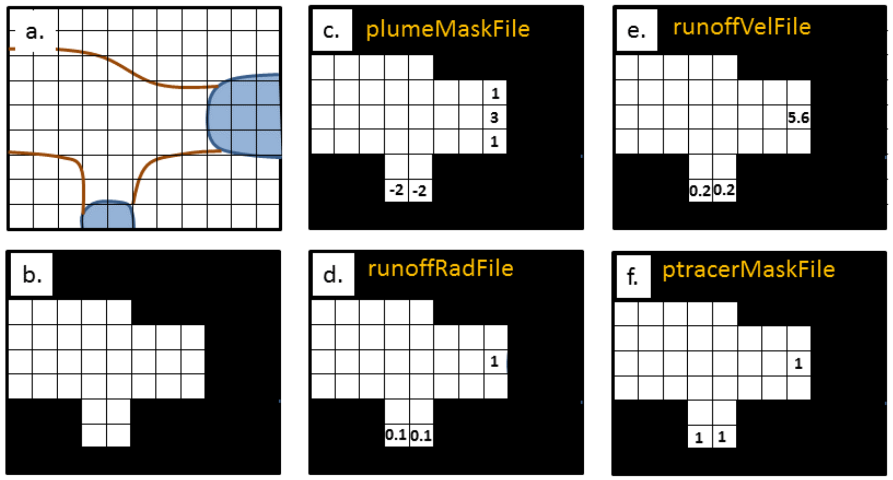

.. _sub_phys_pkg_iceplume:

ICEPLUME Package
-----------------

Author: Tom Cowton, An T. Nguyen

.. _ssub_phys_pkg_iceplume_intro:

Introduction
~~~~~~~~~~~~

The purpose of package :filelink:`ICEPLUME <pkg/iceplume>` is to permit the efficient incorporation of glaciers,
and specifically glacial runoff, in simulations of fjord systems. The package, written by Tom Cowton and used in
Cowton et al. (2015) :cite:`cowton:15`, provides a subgrid-scale parameterization for subglacial and submarine melt
plumes at a vertical glacial front.  This is done through usage of a theoretical plume model to parameterise vertical
transport in the plume adjacent to the glacier front.  The parameterization represents steady-state entrainment of
volume, mass, temperature and salt tendencies at the vertical glacial ice/ocean interface as melt plumes rise from
sub-surface source to its neutral buoyance depth in the water column. It is therefore suitable for use in coarser
resolution and hydrostatic simulations, permitting larger domains and longer model runs.

At its core, the package solves two sets of equations: A set of 4-equations Morton et al. (1956) :cite:`morton:56`
for mass, momentum, heat, and salt conservation for a steady-state buoyancy plume that entrains ambient
water properties, followed by a set of 3-equations solving for submarine melt rate from the vertical ice
front in response to the rising plume following Holland and Jenkins (1999) :cite:`holland:99`.

.. _ssub_phys_pkg_iceplume_config:
  
ICEPLUME configuration
~~~~~~~~~~~~~~~~~~~~~~~

Compile-time options
^^^^^^^^^^^^^^^^^^^^

:filelink:`pkg/iceplume` can be included on at compile
time in the ``packages.conf`` file by adding a line ``iceplume``  (see :numref:`using_packages`).

Parts of the :filelink:`pkg/iceplume`  code can be enabled or disabled at compile time via
CPP flags. These options are set in :filelink:`ICEPLUME_OPTIONS.h <pkg/iceplume/ICEPLUME_OPTIONS.h>`. 

.. tabularcolumns:: |\Y{.475}|\Y{.1}|\Y{.45}|
.. table:: CPP flags used by :filelink:`pkg/iceplume`.
   :name: tab_phys_pkg_iceplume_cpp

   +-----------------------------------------------+---------+----------------------------------------------------------------------------------------------------------------------+
   | CPP Flag Name                                 | Default | Description                                                                                                          |
   +===============================================+=========+======================================================================================================================+
   | :varlink:`ICEPLUME_ALLOW_DETACHED_PLUME`      | #define | allow for detached plume                                                                                             |
   +-----------------------------------------------+---------+----------------------------------------------------------------------------------------------------------------------+
   | :varlink:`ICEPLUME_ALLOW_SCHULZ22`            | #undef  | allow for Schulz et al. (2022) :cite:`schulz:22` melt parameterization                                               |
   +-----------------------------------------------+---------+----------------------------------------------------------------------------------------------------------------------+

.. _ssub_phys_pkg_iceplume_runtime:

Enabling the package
^^^^^^^^^^^^^^^^^^^^

Once it has been compiled, :filelink:`pkg/iceplume` is switched on/off at run-time by setting :varlink:`useICEPLUME` to ``.TRUE.`` in file ``data.pkg``.

Runtime parameters: general flags and parameters
^^^^^^^^^^^^^^^^^^^^^^^^^^^^^^^^^^^^^^^^^^^^^^^^

Run-time parameters are set in file ``data.iceplume`` (read in :filelink:`iceplume_readparms.F <pkg/iceplume/iceplume_readparms.F>`).
General :filelink:`pkg/iceplume` parameters are set under :varlink:`ICEPLUME_PARM01`, :varlink:`ICEPLUME_PARM02` and :varlink:`ICEPLUME_PARM03` as described in :numref:`tab_phys_pkg_iceplume_runtimeparms`.

.. tabularcolumns:: |\Y{.3}|\Y{.125}|\Y{.6}|
.. table:: Run-time parameters and default values (defined under :varlink:`ICEPLUME_PARM01`, :varlink:`ICEPLUME_PARM02` and :varlink:`ICEPLUME_PARM03` namelists)
   :name: tab_phys_pkg_iceplume_runtimeparms

   +-------------------------------------------+------------------------------+--------------------------------------------------------------------------------------------------------------------+
   | Parameter                                 | Default                      | Description                                                                                                        |
   +===========================================+==============================+====================================================================================================================+
   | :varlink:`runoffQsgfile`                  |     :kbd:`' '`               | Subglacial Runoff file  (unit kg s-1)                                                                              |
   +-------------------------------------------+------------------------------+--------------------------------------------------------------------------------------------------------------------+
   | :varlink:`plumeMaskFile`                  |     :kbd:`' '`               | xy mask of iceplume types, containing integer values within range -7 to +7                                         |
   +-------------------------------------------+------------------------------+--------------------------------------------------------------------------------------------------------------------+
   | :varlink:`plumeLengthFile`                |     :kbd:`' '`               | file of length of plume, unit meter                                                                                |
   +-------------------------------------------+------------------------------+--------------------------------------------------------------------------------------------------------------------+
   | :varlink:`T_sg_0`                         |     1.0e-3                   | subglacial runoff potential temperature [deg C]                                                                    |
   +-------------------------------------------+------------------------------+--------------------------------------------------------------------------------------------------------------------+
   | :varlink:`S_sg_0`                         |     1.0e-3                   | subglacial runoff salinity [g kg-1]                                                                                |
   +-------------------------------------------+------------------------------+--------------------------------------------------------------------------------------------------------------------+
   | :varlink:`Angle_sg_0`                     |     pi/2                     | initial angle of subglacial discharge injection with respect to horizon [deg]                                      |
   +-------------------------------------------+------------------------------+--------------------------------------------------------------------------------------------------------------------+
   | :varlink:`wVel_sg_0`                      |     1.0                      | Initial vertical velocity of subglacial discharge at point source [m s-1]                                          |
   +-------------------------------------------+------------------------------+--------------------------------------------------------------------------------------------------------------------+
   | :varlink:`RTOL`                           |     1.0e-5                   | Relative tolerance parameter for ODE solver                                                                        |
   +-------------------------------------------+------------------------------+--------------------------------------------------------------------------------------------------------------------+
   | :varlink:`ATOL`                           |     1.0e-5                   | Absolute tolerance parameter for ODE solver                                                                        |
   +-------------------------------------------+------------------------------+--------------------------------------------------------------------------------------------------------------------+
   | :varlink:`E_0`                            |     0.1                      | Entrainment parameter in plume model [unitless]                                                                    |
   +-------------------------------------------+------------------------------+--------------------------------------------------------------------------------------------------------------------+
   | :varlink:`iceTemp`                        |     0.                       | Temperature of ice in contact with ocean [deg C]                                                                   |
   +-------------------------------------------+------------------------------+--------------------------------------------------------------------------------------------------------------------+
   | :varlink:`usePlumeDiagnostics`            |     .FALSE.                  | Option to write out iceplume properties through required pkg diagnostics                                           |
   +-------------------------------------------+------------------------------+--------------------------------------------------------------------------------------------------------------------+
   | :varlink:`conserveMass`                   |     .FALSE.                  | Adjust plume outflow to prevent net addition of mass due to runoff and melt if true.                               |
   +-------------------------------------------+------------------------------+--------------------------------------------------------------------------------------------------------------------+
   | :varlink:`c_i`                            |     2.009e3                  | Heat capacity of ice [J kg-1 degC-1]                                                                               |
   +-------------------------------------------+------------------------------+--------------------------------------------------------------------------------------------------------------------+
   | :varlink:`lambda1`                        |    -5.73e-2                  | freezing point slope [degC (g/kg)-1]                                                                               |
   +-------------------------------------------+------------------------------+--------------------------------------------------------------------------------------------------------------------+
   | :varlink:`lambda2`                        |     8.32e-2                  | freezing point offset [degC]                                                                                       |
   +-------------------------------------------+------------------------------+--------------------------------------------------------------------------------------------------------------------+
   | :varlink:`lambda3`                        |     7.61e-4                  | freezing point depth [degC  m-1]                                                                                   |
   +-------------------------------------------+------------------------------+--------------------------------------------------------------------------------------------------------------------+
   | :varlink:`GamT`                           |     2.2e-2                   | Thermal turbulent transfer coefficient [unitless]                                                                  |
   +-------------------------------------------+------------------------------+--------------------------------------------------------------------------------------------------------------------+
   | :varlink:`GamS`                           |     6.2e-4                   | Haline turbulent transfer coefficient [unitless]                                                                   |
   +-------------------------------------------+------------------------------+--------------------------------------------------------------------------------------------------------------------+
   | :varlink:`Cd`                             |     2.5e-3                   | Ice plume drag coefficient [unitless]                                                                              |
   +-------------------------------------------+------------------------------+--------------------------------------------------------------------------------------------------------------------+
   | :varlink:`useSheetPlume`                  |    .FALSE.                   | use 2d sheet plume at ice-ocean interface if true                                                                  |
   +-------------------------------------------+------------------------------+--------------------------------------------------------------------------------------------------------------------+
   | :varlink:`useConePlume`                   |    .FALSE.                   | use 2d cone-shaped steady-state plume at ice-ocean interface if true                                               | 
   +-------------------------------------------+------------------------------+--------------------------------------------------------------------------------------------------------------------+
   | :varlink:`useTruncPlume`                  |    .FALSE.                   | use 2d sheet plume but truncated in the along-ice dimension                                                        |
   +-------------------------------------------+------------------------------+--------------------------------------------------------------------------------------------------------------------+
   | :varlink:`useBuoyPlume`                   |    .FALSE.                   | use buoyancy plume type                                                                                            |
   +-------------------------------------------+------------------------------+--------------------------------------------------------------------------------------------------------------------+
   | :varlink:`slopeTmod`                      |     0.5                      | slope of line  fit of ptemp between submarine melt plume and fjord                                                 |
   +-------------------------------------------+------------------------------+--------------------------------------------------------------------------------------------------------------------+
   | :varlink:`interceptTmod`                  |     0.0                      | intercept of line fit of ptemp between submarine melt plume and fjord                                              |
   +-------------------------------------------+------------------------------+--------------------------------------------------------------------------------------------------------------------+
   | :varlink:`facGamSGamT`                    |     0.07                     | factor relating GamS and GamT, use when defined ICEPLUME_ALLOW_SCHULZ22                                            |
   +-------------------------------------------+------------------------------+--------------------------------------------------------------------------------------------------------------------+
   | :varlink:`GamTconst`                      |     0.001                    | constant GamT, use when defined ICEPLUME_ALLOW_SCHULZ22                                                            |
   +-------------------------------------------+------------------------------+--------------------------------------------------------------------------------------------------------------------+
   | :varlink:`Lp`                             |     2.2e2                    | length of truncated plume [m], use when defined ICEPLUME_ALLOW_SCHULZ22                                            |
   +-------------------------------------------+------------------------------+--------------------------------------------------------------------------------------------------------------------+
   | :varlink:`maxDepth`                       |    rF(Nr+1)                  | vertical extent of domain [m]                                                                                      |
   +-------------------------------------------+------------------------------+--------------------------------------------------------------------------------------------------------------------+
   | :varlink:`backgroundVelThresh`            |     0.05                     | Unresolved velocity at ice-ocean interface [m s-1]                                                                 |
   +-------------------------------------------+------------------------------+--------------------------------------------------------------------------------------------------------------------+
   | :varlink:`ICEPLUMElatentHeat`             |     3.34e5                   | Latent heat of melting [J kg-1]                                                                                    |
   +-------------------------------------------+------------------------------+--------------------------------------------------------------------------------------------------------------------+
   | :varlink:`ICEPLUMEHeatCapacity_Cp`        |     2.e3                     | Heat capacity of ice [J kg-1 degC-1]                                                                               |
   +-------------------------------------------+------------------------------+--------------------------------------------------------------------------------------------------------------------+
   | :varlink:`applyIcePlumeBGTendT`           |    .TRUE.                    | apply iceplume ptemp tendency gT to ocean ptemp if true                                                            |
   +-------------------------------------------+------------------------------+--------------------------------------------------------------------------------------------------------------------+
   | :varlink:`applyIcePlumeBGTendS`           |    .TRUE.                    | apply iceplume salt tendency gS to ocean salinity if true                                                          |
   +-------------------------------------------+------------------------------+--------------------------------------------------------------------------------------------------------------------+
   | :varlink:`ptracerMaskFile`                |     :kbd:`' '`               | Nx x Ny x n_ptracers mask, concentration of ptracer in subglacial runoff in the location, requires pkg ptracers    |
   +-------------------------------------------+------------------------------+--------------------------------------------------------------------------------------------------------------------+
   | :varlink:`useInputPtracers`               |    .FALSE.                   | Add a quantity of ptracer to the plume volume of subglacial runoff, requires pkg/ptracers                          |
   +-------------------------------------------+------------------------------+--------------------------------------------------------------------------------------------------------------------+
   | :varlink:`runoffQsgperiod`                |     0.0                      | repeat cycle, 0=one-time constant, -12=monthly climatology                                                         |
   +-------------------------------------------+------------------------------+--------------------------------------------------------------------------------------------------------------------+
   | :varlink:`runoffQsgStartTime`             |     UNSET_RL                 | xxx                                                                                                                |
   +-------------------------------------------+------------------------------+--------------------------------------------------------------------------------------------------------------------+
   | :varlink:`runoffQsgstartdate1`            |     0                        | format yyyymmdd                                                                                                    |
   +-------------------------------------------+------------------------------+--------------------------------------------------------------------------------------------------------------------+
   | :varlink:`runoffQsgstartdate2`            |     0                        | format hhmmss                                                                                                      |
   +-------------------------------------------+------------------------------+--------------------------------------------------------------------------------------------------------------------+
   | :varlink:`runoffQsgconst`                 |     0.0                      | additive constant, unit kg                                                                                         |
   +-------------------------------------------+------------------------------+--------------------------------------------------------------------------------------------------------------------+
   | :varlink:`runoffQsg_inscal`               |     1.0                      | scaling factor, unitless                                                                                           |
   +-------------------------------------------+------------------------------+--------------------------------------------------------------------------------------------------------------------+
   | :varlink:`runoffQsg_remov_intercept`      |     0.0                      | zero-crossing intercept to be removed, unit kg                                                                     |
   +-------------------------------------------+------------------------------+--------------------------------------------------------------------------------------------------------------------+
   | :varlink:`runoffQsg_remov_slope`          |     0.0                      | slope to be removed [kg s-1]                                                                                       |
   +-------------------------------------------+------------------------------+--------------------------------------------------------------------------------------------------------------------+
   | :varlink:`runoffQsgRepCycle`              |     0.0                      | xxx                                                                                                                |
   +-------------------------------------------+------------------------------+--------------------------------------------------------------------------------------------------------------------+
   | :varlink:`runoffQsg_interpMethod`         |     0                        | 0=no interpolation, 1=do interpolation from Qsg grid to model grid                                                 |
   +-------------------------------------------+------------------------------+--------------------------------------------------------------------------------------------------------------------+
   | :varlink:`runoffQsg_lon0`                 |     0.                       | subglacial runoff discharge first point longitude                                                                  |
   +-------------------------------------------+------------------------------+--------------------------------------------------------------------------------------------------------------------+
   | :varlink:`runoffQsg_lon_inc`              |     0.                       | longitude increment                                                                                                |
   +-------------------------------------------+------------------------------+--------------------------------------------------------------------------------------------------------------------+
   | :varlink:`runoffQsg_nlon`                 |     0                        | number of longitudes                                                                                               |
   +-------------------------------------------+------------------------------+--------------------------------------------------------------------------------------------------------------------+
   | :varlink:`runoffQsg_lat0`                 |     0.                       | first point latitude in the Qsg grid                                                                               |
   +-------------------------------------------+------------------------------+--------------------------------------------------------------------------------------------------------------------+
   | :varlink:`runoffQsg_lat_inc`              |     0.                       | increment                                                                                                          |
   +-------------------------------------------+------------------------------+--------------------------------------------------------------------------------------------------------------------+
   | :varlink:`runoffQsg_nlat`                 |     0                        | number of latitudes                                                                                                |
   +-------------------------------------------+------------------------------+--------------------------------------------------------------------------------------------------------------------+
 
.. _ssub_phys_pkg_iceplume_domain_setup:

Parameter descriptions
^^^^^^^^^^^^^^^^^^^^^^

The plumeMaskFile stores a 2D matrix of size of nx x ny (the whole model domain) giving the type and
location of proglacial plumes in the domain (Figure 1). At each grid location, the value in the matrix
specifies: 0 = no glacier ice or runoff; 1 = vertical glacier ice (permitting melting), but no input
of meltwater runoff; 2 = ‘sheet plume’ (Jenkins 2011); 3 = ‘half-conical plume’ (Cowton et al 2015);
4 = both sheet and half-conical plume (NOT IMPLEMENTED); 5 = detaching conical plume (must be permitted
in ICEPLUME_OPTIONS.h); 6 = buoyant plume. Options 0-3 can be specified in different locations in the
same domain. 4 is not presently available. 5 modifies the size of some fields, and so must be used in
isolation. In cases 1-5, it is assumed that there is a vertical wall of ice spanning the full depth
of the water column and full width of the cell. Unlike in the pkg/icefront, this does not act as a
physical barrier to flow (the glacier should instead be defined as land in the model bathymetry, and
adjacent cells masked appropriately using the values above). The purpose of the virtual ice wall in
IcePlume is to permit the calculation of the melt rate, and to modify the temperature and salinity of
the cell accordingly. To do this, it is necessary to define the orientation of the virtual ice front,
so that the impact of horizontal currents on melt rate can be calculated. This is done by selecting
the sign of the mask values – a positive value defines the icefront as being orientated along a 
north-south axis, while a negative value defines an east- west orientation.

The runoffQsgFile gives a 2D matrix defining the strength of the runoff input at any x,y location (Figure 1).
The field contained in this file assumes an initial discharge radius runoffRad and initial vertical velocity
runoffVel.  By default, the runoffVel is set to 1.0 m/s (non-changeable), and the radius can be calculated
from there.  When use without pkg/exf, the field can have dimension nx x ny x nt. When use with pkg/exf, all
temporal variables are defined using parameters following pkg/exf conventions.

In the case of the sheet plume (2) and half-conical plume (3), the interpretation of runoffVel is that it is
the velocity by necessity in a vertical direction. In the case of the detatching plume, the direction of input
can be specified (4). As for other forcings / boundary conditions in MITgcm, this forcing can change over time
by specifying multiple time layers in the third dimension (see periodicExternalForcing in data, or the EXF package).

The interpretation of runoffRad is that it specifies the radius or thickness of the input runoff Qsg. In
the case of the half-conical or detatching plume, this value is the initial plume radius, and can be thought
of as the radius of the subglacial channel. In the case of the sheet plume, specify the thickness of the
initial sheet in the direction perpendicular the icefront (the width of the sheet parallel to the icefront
is assumed to span the width of the cell). As for runoff velocity, this value can vary over time.

Except for the detatching plume, the exact values of velocity and radius are not important, so long as they
combine to give the desired discharge. For example, it is convenient to set runoff velocity to 1 m/s, and
modify the runoff radius so that runoff is equal to the discharge of meltwater from that channel.

Note that if the specified plume mask value in a location includes runoff (i.e. types 2- 5), there must also be
a value of runoff velocity and runoff or else the plume will not generate. Likewise, specifying a value of
runoff velocity or radius without an appropriate value in the plume mask file will have no effect.

The logical flag conserveMass, when set to false, the volume of water output from the plume is equal to the
volume of subglacial runoff added plus the volume of ambient water entrained into the plume. The entrained
water is neutral with respect to the volume of the domain, but the addition of the subglacial runoff results
in a small net volume gain. This becomes problematic if it cannot under the constraints of the scenario be
balanced by a net outflow across an open boundary. If this is the case, conserveMass, can be used, when set
to true, to scale down the output from the plume such that it this net input is eliminated. This generally
only results in a small decrease in plume output (<2%), because the majority of the plume is comprised of
entrained fjord waters.

The backgroundVelThresh provides the vertical velocity magnitude at the icefront, particularly melt driven
convection, may by driven by processes too fine to resolve in the model set up (e.g. requiring a metre scale
grid). These currents are however important as they strongly influence the melt rate. In this case,
backgroundVelThresh can be used to specify a constant minimum background velocity which is applied in the melt
parameterisation in the absence of stronger currents. From laboratory, field and modelling studies, it is
expected that melt driven convection should be relatively consistent over time, and of the order of 0.01-0.1 m/s.

The parameter E_0 is the entrainment coefficient in the plume model. A value of 1 is commonly used, but it may
vary between 0.07-0.16 along a continuum from forced jets to buoyant plumes (Kaminski et al. 2005). Proglacial
plumes are buoyancy dominated, and so values in the upper half of this range may be appropriate.

The logical parameter useInputPtracers, in conjunction with pkg/ptracers, add a quantity of ptracer to the
plume output, corresponding to the volume of subglacial runoff, requires pkg/ptracers.
The concentration of this tracer represents the proportion of water in a cell that was originally
glacial runoff (e.g. 1 means the cell is filled entirely with subglacial runoff). This enables the flow of these
waters to be tracked. This volume represents only the subglacial discharge, not the total volume of the plume
(which is mainly entrained fjord water). Whether or not this option is selected, the plume model will transport
any existing ptracers that become entrained in the plume When using pkg/iceplume in conjunction with pkg/ptracers,
the modified version of ptracers_apply_forcing.F must be included in the local code directory.

The parameter ptracerMaskFile, when useInputPtracers = .TRUE., must be used to give the concentration of the
different ptracers in the subglacial runoff. The mask has dimension nx by ny by n_ptracers, where n_ptracers
corresponds to PTRACERS_numInUse in data.ptracers. A value should be given for each ptracer for each plume location,
as specified in plumeMaskFile. If a value of zero is given, that tracer will not be added in that location. If a
ptracer value is assigned in a non-plume location, it will not trigger a warning; it will simply have no effect.
The ptracer is added to the plume as subglacial_discharge * ptracerMask value. For example, if the runoff fraction
fraction is the quantity of interest, the ptracerMask value should be set as 1.

.. _ssub_phys_pkg_iceplume_descr:
  
Description
~~~~~~~~~~~

.. _ssub_phys_pkg_iceplume_eqns:

Equations Solved
^^^^^^^^^^^^^^^^

Units of input files
^^^^^^^^^^^^^^^^^^^^

Numerical Details
~~~~~~~~~~~~~~~~~

   A simplified example set up for IcePlume. a. The scenario contains two glaciers draining into a small fjord system. b. Mask out the land and glaciers by setting bathymetry to equal zero. c. The plumeMaskFile values around the glacier fronts describe areas in which there is ice but no subglacial runoff (1), a sheet plume (distrubted runoff input; 2) or half-conical plume (discrete runoff input; 3). d-e. The runoffRadFile and runoffVelFile values combine to give a discrete input of 50 m3s-1 at the eastern glacier and a distrubted input of 20 m3a-1 along the southern glacier (given a grid resolution of 500 m). f. Finally, the ptacerMaskFile specified that the add runoff should have a ptracer(1) concentration of 1 in all plume locations. If more than one ptracer is used, the ptracerMask will must have the same number of layers as ptracers. In c-f., grid cell values not shown are equal to zero. Note that this figure is for illustrative purposes only – IT DOES NOT show the set up for the example experiment

Known restrictions and issues
~~~~~~~~~~~~~~~~~~~~~~~~~~~~~

For the sake of simplicity, partial cells (hFac<1) are not permitted in ice front locations (i.e. where the
plume mask does not equal 0). Doing so will cause the model to terminate. It is therefore necessary to ensure
that the seafloor depth is equal to a full cell thickness in ice front locations.

Development: in the newer code, the plume will now start at the cell boundary above the sea bed if the sea bed
does not coincide with a cell boundary. If a plume is placed in a dry cell, this will now trigger an error.
Specifying a runoff velocity or radius of zero is problematic. In some circumstances it seems permissible and
will not generate an error (or a plume); however, a transition (using periodicExternalForcing) from a nonzero
value to a zero value seems to cause the model to crash without warning or error message.

The package has been most thoroughly tested with the Portland Group compilers. Bugs may exist that show up when
using alternative compilers.

Rather than compiling ODEPACK directly into the model, it may be preferable to compile it as an external library
linked to MITgcm.

Key Subroutines
~~~~~~~~~~~~~~~

Key routines are iceplume_calc.F and iceplume_plume_model.F. iceplume_calc.F is the main routine. This locates cells
with runoff input, obtains profiles of ambient water properties, calls the plume appropriate plume model, calculates
the vertical distribution of plume entrainment and outflow, calls the routine to calculate background meltrate,
calculates the tendency and addmass terms, and sends information to the diagnostics fill routines.
iceplume_plume_model.F contains the main loop for the plume model and several subroutines describing the individual plumes models.

Top-level routine: :filelink:`iceplume_calc.F <pkg/iceplume/iceplume_calc.F>` (called from :filelink:`model/src/do_oceanic_phys.F`)

::

    CALLING SEQUENCE
 ...
  FORWARD_STEP
  |--load_fields_driver
  |   #ifndef ALLOW_EXF
  |     external_fields_load (read in runoffQsg from runoffQsgFile)
  |   #else
  |     exf_getforcing
  |     exf_getffields (read runoffQsg from runoffQsgFile)
  |   #endif

  ICEPLUME_CALC (called from DO_OCEANIC_PHYS)
  |
  |    ICEPLUME_PLUME_MODEL
  |    |
  |    |-- SHEETPLUME
  |    |     ICEPLUME_MELTRATE
  |    |-- HALFCONE
  |    |     ICEPLUME_MELTRATE
  |    |-- DETACHED_CONE
  |    |     ICEPLUME_MELTRATE
  |    |-- WANDW
  |    |     ICEPLUME_MELTRATE
  |    |
  |    ICEPLUME_MELTRATE

ICEPLUME diagnostics
~~~~~~~~~~~~~~~~~~~~~

The usePlumeDiagnostics, if true, enables outputs of several additional diagnostics relating to pkg/iceplume.
The diagnostics for the plumes are output as a 4D matrix (nx,ny,nz,nt). Values will be zero except for those
locations given in the plumeMaskFile.  diagnostics for ocean tendencies of mass, salt, and temperature are
fully 3D. Available output fields are summarized in the following table:

.. code-block:: text

    ----------------------------------------------------------------------------
    <-Name->|Levs|  mate |<- code ->|<--  Units   -->|<- Tile (max=80c)
    ----------------------------------------------------------------------------
    icefrntW|  1 |       |SM      L1|m/s             |Plume vertical velocity
    icefrntT|  1 |       |SM      L1|degC            |Plume temperature
    icefrntS|  1 |       |SM      L1|g/kg            |Plume salinity
    icefrntR|  1 |       |SM      L1|m               |Plume thickness
    icefrntM|  1 |       |SM      L1|m d-1           |Plume melt rate
    icefrntA|  1 |       |SM      L1|m d-1           |Average cell melt rate
    PlumAngl|  1 |       |SM      L1|none            |Angle of detached plume
    PlumDist|  1 |       |SM      L1|m               |Distance of detached plume from wall
    IP_gTbg |  1 |       |SM      L1|degC/s          |Temperature tend from iceplumeBG, >0 incr ocn T
    IP_gSbg |  1 |       |SM      L1|g/kg/s          |Salinity tend from iceplumeBG, >0 incr ocn S
    IP_gTplm|  1 |       |SM      L1|degC/s          |Temperature tend from plume, >0 incr ocn T
    IP_gSplm|  1 |       |SM      L1|g/kg/s          |Salinity tend from plume, >0 incr ocn S
    IPmasspl|  1 |       |SM      L1|kg/s            |addMass from plume, >0 incr ocn mass
    IPmassbg|  1 |       |SM      L1|kg/s            |addMass from iceplumeBG, >0 incr ocn mass

Experiments and tutorials that use iceplume
~~~~~~~~~~~~~~~~~~~~~~~~~~~~~~~~~~~~~~~~~~~~

The :filelink:`verification_other/iceplume_testcase` experiment uses :filelink:`pkg/iceplume`.

.. other references

.. Schulz 2022
